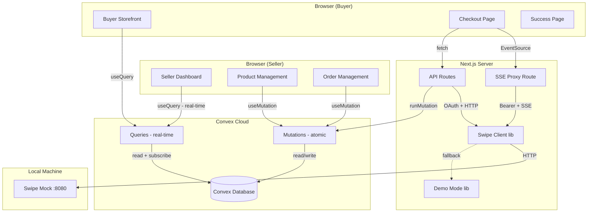
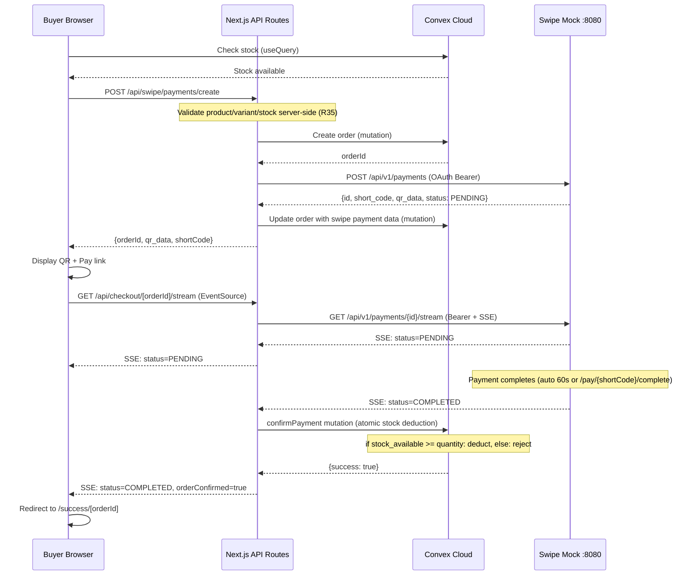

# feat: Build Swipe Social Storefront Hackathon MVP

## Summary

This plan implements a mobile-first social commerce platform for Maldives-based Instagram/Facebook sellers using Next.js App Router, Convex (database + real-time), and the BML Swipe mock payment API. The architecture splits responsibility: Next.js API routes handle all Swipe API communication (OAuth, payments, SSE proxy) since Convex cloud cannot reach `localhost:8080`, while Convex handles persistence, atomic stock operations, and real-time data sync. The plan covers 17 implementation units across 3 phases: foundation, core flows, and polish.

---

## Problem Frame

Maldives social sellers manually manage stock, verify bank transfers, and reconcile payments through Instagram/Facebook DMs. This creates fake-slip fraud, overselling, delayed confirmations, and no structured records. See origin for the full pain narrative. (see origin: `docs/brainstorms/2026-05-20-swipe-social-storefront-requirements.md`)

---

## Requirements

All 36 requirements from the origin document are in scope. Key groupings:

- R1-R4: Buyer storefront (product grid, detail, OG tags, share buttons)
- R5-R10: Delivery and checkout (form, QR+link, SSE, payment confirmation, simulate, retry)
- R11-R12: Post-payment buyer experience (success page, message seller)
- R13-R17: Seller product management + social captions
- R18-R21: Seller order and fulfillment management
- R22-R25: Swipe integration depth (wallet, history, token caching, payment description)
- R26-R27: Demo and presentation (landing page, seed data)
- R28-R36: Technical foundation (auth, price validation, secrets, currency, timezone, demo mode, loading states, SSE fallback, form validation)

**Origin actors:** A1 (Buyer), A2 (Seller), A3 (Swipe API), A4 (Hackathon judges)
**Origin flows:** F1 (Buyer purchase), F2 (Seller product/social), F3 (Seller order management), F4 (Hackathon demo)
**Origin acceptance examples:** AE1-AE2 (R6 viewport), AE3 (R7/R8 SSE+stock), AE4 (R9 retry), AE5 (R8 race condition), AE6 (R27 restart), AE7 (R31/R10 demo mode), AE8 (R20 fulfillment)

---

## Scope Boundaries

Carried from origin:
- No real Instagram/Facebook auto-publishing
- No real Swipe credentials or production payments (mock API only)
- No buyer accounts or login (anonymous, identity per-order)
- No cart or multi-product orders (single product per order)
- No delivery outside Male' and Hulhumale'
- No refund automation
- No multi-tenant billing or subscription
- No native mobile app (responsive web only)
- No stock reservation/hold system (atomic deduction on payment confirmation only)
- No Swipe webhook signature verification (SSE is primary)
- No image upload for sellers (placeholder URLs only)
- No real-time seller notifications via push/websocket (Convex real-time queries provide automatic refresh)
- No product search (category filtering only)

---

## Context & Research

### Relevant Code and Patterns

**Swipe mock API (`swipe-merchants-dev/`):**
- OpenAPI spec at `swipe-merchants-dev/spec/app.yaml` — source of truth for all endpoints
- Reference integration at `swipe-merchants-dev/example/main.go` — demonstrates OAuth flow, payment creation, SSE streaming, and `/pay/{shortCode}/complete` simulation
- Mock binary built via `make build` in `swipe-merchants-dev/`, runs on `http://127.0.0.1:8080`
- Mock auto-completes PENDING payments after 60 seconds (`PaymentTransitionTTL`)
- API keys created via `swipe keys create --name <name> --scopes <scopes> --output json`

**Swipe API endpoints used:**
| Endpoint | Method | Scope | Purpose |
|----------|--------|-------|---------|
| `/oauth2/token` | POST | — | Get access token (Basic Auth) |
| `/api/v1/payments` | POST | `payments:qr` | Create QR payment |
| `/api/v1/payments/{id}` | GET | `transactions:status` | Poll payment status |
| `/api/v1/payments/{id}/stream` | GET | `transactions:status` | SSE stream (requires Bearer) |
| `/api/v1/balance` | GET | `wallet:balance` | Wallet balance |
| `/api/v1/history` | GET | `transactions:history` | Transaction list with fees |
| `/api/v1/whoami` | GET | — | Verify auth |
| `/pay/{shortCode}/complete` | POST | — | Unauthenticated mock demo completion |

### Institutional Learnings

No `docs/solutions/` directory exists yet (greenfield project).

### External References

- Convex + Next.js App Router: https://docs.convex.dev/client/nextjs/app-router/
- Convex mutations (atomic transactions): https://docs.convex.dev/functions/mutation-functions
- Convex actions (external HTTP calls): https://docs.convex.dev/functions/actions
- Convex schema + indexes: https://docs.convex.dev/database/schemas
- Convex seeding data: https://stack.convex.dev/seeding-data-for-preview-deployments

---

## Key Technical Decisions

- **Split responsibility architecture**: Next.js API routes handle all Swipe API communication (OAuth, payment creation, SSE proxy, wallet/history) because Convex actions run in Convex's cloud and cannot reach `localhost:8080`. Convex handles all persistence, real-time subscriptions, and atomic mutations. Next.js API routes call Convex mutations to persist Swipe results.

- **SSE proxy pattern**: A Next.js API route at `/api/checkout/[orderId]/stream` authenticates to the Swipe SSE endpoint with the cached merchant Bearer token, reads the SSE stream server-side, and re-emits events to the browser client via a standard SSE response. The browser uses `EventSource` to connect to the Next.js route (same origin, no CORS issues). On connection failure, the client falls back to polling a Next.js API route that calls `GET /api/v1/payments/{id}`.

- **Convex for real-time dashboard**: Seller dashboard components use Convex `useQuery` hooks which auto-update when underlying data changes. When a buyer's payment completes and the Next.js API route calls a Convex mutation to mark the order paid + deduct stock, the seller's dashboard automatically reflects the change without polling. This satisfies R19 (new order indicator) natively.

- **OAuth token caching**: In-memory singleton in the Next.js server process. Caches `access_token` and `expires_at`. Refreshes 60 seconds before expiry. Resets on server restart (acceptable — new token obtained on first API call). Token never exposed to browser or logged.

- **Single-product order model**: Each order stores `productId`, `variantId`, and `quantity` directly on the order document. No separate `orderItems` collection for MVP. Rationale: reduces Convex schema complexity for single-product-per-order flow.

- **Demo mode (SWIPE_DEMO_MODE)**: When set, Next.js API routes return hardcoded mock responses instead of calling `localhost:8080`. The SSE proxy simulates a PENDING → COMPLETED transition after 3 seconds. The Simulate Payment button triggers the local mock completion. This is entirely within Next.js — Convex is unaware of demo mode.

- **Static demo images**: 5 product images bundled in `public/demo-products/` (e.g., `abaya.jpg`, `gift-box.jpg`, etc.). Zero network dependency. Seed script references these paths.

- **Seller auth via store slug + PIN + session token**: A Next.js API route (`POST /api/auth/login`) receives the slug+PIN, verifies via a Convex query, and on success generates a random session token (crypto.randomUUID). The token is stored server-side in an in-memory Map keyed by token → storeId, and returned to the browser as an httpOnly secure cookie (`seller_session`). All seller API routes and Convex calls validate this cookie server-side before processing. The `storeId` is never trusted from the client — it's always resolved from the session token on the server. Middleware on seller pages checks for the cookie and redirects to `/seller/login` if missing or invalid. For Vercel deployment: the in-memory session map resets on cold starts; acceptable for a demo (seller re-enters PIN).

- **Buyer checkout access tokens**: Each order gets a random `accessToken` (crypto.randomUUID) stored on the order document at creation time. The checkout and success page URLs include this token as a query parameter (`?token=xxx`). The SSE stream route and success page validate the token before returning order data. This prevents orderId enumeration from leaking buyer PII without requiring buyer accounts.

- **Vercel deployment note**: When deployed to Vercel, the Next.js server cannot reach `localhost:8080` (the Swipe mock). Set `SWIPE_DEMO_MODE=true` for Vercel deployments — all Swipe interactions use the in-memory demo mode. Convex cloud works normally from Vercel. The in-memory OAuth token cache and session map reset on serverless cold starts; acceptable for demo duration. Note: Vercel may route requests to different serverless instances, each with their own in-memory session Map. During a single-seller demo, instance affinity usually prevents issues, but under concurrent load sessions could appear to vanish. If this surfaces, store sessions in Convex instead.

---

## Open Questions

### Resolved During Planning

- **Token caching strategy (R24):** In-memory singleton in Next.js process with TTL-based refresh. Acceptable for hackathon — restarts just get a new token.
- **Image placeholder strategy (R13):** Static images in `public/demo-products/`. Zero external dependency.
- **Convex vs localhost (architecture):** Swipe calls go through Next.js API routes, not Convex actions. Convex handles persistence only.

### Deferred to Implementation

- **Exact Convex index optimization:** The implementer should add indexes as needed based on query patterns. Schema below includes obvious ones; additional indexes may surface during implementation.
- **Tailwind component library:** Whether to use shadcn/ui, Radix, or hand-rolled components. Implementer's choice based on speed.
- **SSE reconnection timing:** The 3-attempt reconnect before polling fallback (R33) may need tuning based on mock behavior.
- **AI caption endpoint auth:** The `/api/social/caption` route calls the Anthropic API (costs money). Consider requiring seller session authentication before generating captions, to prevent anonymous callers from consuming API quota. Low priority since the AI feature is optional and the API key may not be configured.

### From 2026-05-20 doc review

- Product imageUrls accept arbitrary user-supplied URLs without validation — potential SSRF/tracking pixel risk on OG meta tags. Consider enforcing `https://` scheme and allowlisting CDN domains.
- Variant selector UI pattern unspecified for multi-dimensional variants (color + size combinations) — implementer should use a flat variant list with combined names like "M / Blue" for MVP.
- Order list filter/pagination: no pagination needed for MVP (Convex real-time handles it), but status tab strip was added to U12.

---

## Output Structure

```
swipe-social-storefront/
├── app/
│   ├── layout.tsx                    # Root layout with ConvexClientProvider
│   ├── page.tsx                      # Landing page (R26)
│   ├── shop/
│   │   └── [storeSlug]/
│   │       ├── page.tsx              # Storefront product grid (R1)
│   │       └── product/
│   │           └── [productId]/
│   │               └── page.tsx      # Product detail (R2)
│   ├── checkout/
│   │   └── [orderId]/
│   │       └── page.tsx              # Checkout with QR+link+SSE (R6,R7)
│   ├── success/
│   │   └── [orderId]/
│   │       └── page.tsx              # Success page (R11,R12)
│   └── seller/
│       ├── login/
│       │   └── page.tsx              # Seller PIN login (R28)
│       ├── layout.tsx                # Seller layout with sidebar + auth guard
│       ├── page.tsx                  # Dashboard overview (R21,R22)
│       ├── products/
│       │   ├── page.tsx              # Product list (R15)
│       │   └── new/
│       │       └── page.tsx          # Add/edit product (R13,R14)
│       ├── orders/
│       │   └── page.tsx              # Order list + fulfillment (R18,R20)
│       ├── social/
│       │   └── page.tsx              # Caption generator (R17)
│       └── settings/
│           └── page.tsx              # Store profile (R16)
├── app/api/
│   ├── auth/
│   │   ├── login/
│   │   │   └── route.ts             # Seller login (session token creation)
│   │   └── logout/
│   │       └── route.ts             # Seller logout (session token deletion)
│   ├── checkout/
│   │   ├── create/
│   │   │   └── route.ts             # Create order + Swipe payment (U6)
│   │   └── [orderId]/
│   │       └── stream/
│   │           └── route.ts         # SSE proxy (R7) — validates accessToken
│   ├── swipe/
│   │   ├── auth/
│   │   │   └── route.ts             # OAuth2 token management
│   │   ├── payments/
│   │   │   ├── create/
│   │   │   │   └── route.ts         # Create Swipe payment only (thin adapter)
│   │   │   ├── [paymentId]/
│   │   │   │   └── status/
│   │   │   │       └── route.ts     # Poll payment status
│   │   │   └── simulate/
│   │   │       └── route.ts         # Simulate payment/expiry/cancel (R10)
│   │   ├── wallet/
│   │   │   └── route.ts             # Wallet balance (R22) — requires seller session
│   │   └── history/
│   │       └── route.ts             # Transaction history (R23) — requires seller session
│   └── social/
│       └── caption/
│           └── route.ts             # Caption generation (R17)
├── convex/
│   ├── schema.ts                    # Convex schema (all tables)
│   ├── init.ts                      # Seed script (R27)
│   ├── stores.ts                    # Store queries/mutations
│   ├── products.ts                  # Product queries/mutations
│   ├── orders.ts                    # Order queries/mutations (atomic stock)
│   └── _generated/                  # Auto-generated by Convex
├── components/
│   ├── ui/                          # Shared UI primitives
│   │   ├── badge.tsx
│   │   ├── button.tsx
│   │   ├── card.tsx
│   │   ├── input.tsx
│   │   └── select.tsx
│   ├── buyer/
│   │   ├── product-card.tsx
│   │   ├── product-grid.tsx
│   │   ├── variant-selector.tsx
│   │   ├── quantity-selector.tsx
│   │   ├── delivery-form.tsx
│   │   ├── checkout-payment.tsx
│   │   ├── payment-status.tsx
│   │   └── share-buttons.tsx
│   ├── seller/
│   │   ├── sidebar.tsx
│   │   ├── dashboard-card.tsx
│   │   ├── product-form.tsx
│   │   ├── order-table.tsx
│   │   ├── order-status-badge.tsx
│   │   ├── swipe-wallet-card.tsx
│   │   ├── transaction-history.tsx
│   │   └── caption-generator.tsx
│   └── shared/
│       ├── mobile-shell.tsx
│       ├── loading-spinner.tsx
│       └── mvr-amount.tsx
├── lib/
│   ├── swipe-client.ts              # Swipe API client (OAuth, payments)
│   ├── swipe-demo.ts                # Demo mode mock responses (R31)
│   ├── convex-server.ts             # Server-side ConvexHttpClient singleton
│   ├── session.ts                   # Seller session token management
│   ├── use-payment-status.ts        # SSE + polling fallback hook
│   ├── caption-templates.ts         # Template-based caption generation
│   ├── validators.ts                # Delivery form validation (R34)
│   ├── format.ts                    # MVR formatting (R29), timezone (R30)
│   └── constants.ts                 # Shared constants
├── public/
│   └── demo-products/
│       ├── abaya.jpg
│       ├── gift-box.jpg
│       ├── phone-case.jpg
│       ├── bracelet.jpg
│       └── dates-box.jpg
├── .env.local.example
├── .gitignore
├── package.json
├── tailwind.config.ts
├── tsconfig.json
├── next.config.ts
└── convex.json
```

---

## High-Level Technical Design

> *This illustrates the intended approach and is directional guidance for review, not implementation specification. The implementing agent should treat it as context, not code to reproduce.*

### Architecture Diagram



### Payment Flow (Buyer Purchase)



### Convex Schema Design

```
stores
  ├── name: string
  ├── slug: string (indexed)
  ├── pin: string
  ├── description: string?
  ├── instagramUsername: string?
  ├── facebookPageUrl: string?
  ├── whatsappNumber: string?
  └── logoUrl: string?

products
  ├── storeId: id("stores") (indexed)
  ├── name: string
  ├── description: string?
  ├── basePrice: number
  ├── currency: string (default "MVR")
  ├── category: string?
  ├── imageUrls: string[] (up to 5)
  ├── status: string ("draft" | "active" | "archived")
  └── createdAt: number

productVariants
  ├── productId: id("products") (indexed)
  ├── variantName: string
  ├── size: string?
  ├── color: string?
  ├── priceOverride: number?
  ├── stockAvailable: number
  └── stockSold: number

orders
  ├── storeId: id("stores") (indexed)
  ├── productId: id("products")
  ├── variantId: id("productVariants")
  ├── quantity: number
  ├── unitPrice: number
  ├── totalAmount: number
  ├── currency: string
  ├── customerName: string
  ├── customerPhone: string
  ├── deliveryLocation: string ("Male'" | "Hulhumale'")
  ├── deliveryAddress: string
  ├── deliveryTimePreference: string?
  ├── status: string ("pending" | "paid" | "shipped" | "delivered" | "cancelled")
  ├── paymentStatus: string ("pending" | "paid" | "expired" | "cancelled")
  ├── swipePaymentId: string?
  ├── swipeReference: string?
  ├── swipeShortCode: string?
  ├── swipeQrData: string?
  ├── swipePaymentUrl: string?
  ├── accessToken: string
  ├── createdAt: number
  └── updatedAt: number
```

### Atomic Stock Deduction (Convex Mutation — Directional)

```
mutation confirmPayment(orderId):
  order = db.get(orderId)
  if order.paymentStatus == "paid": return already-paid
  
  variant = db.get(order.variantId)
  if variant.stockAvailable < order.quantity:
    db.patch(orderId, {status: "cancelled", paymentStatus: "cancelled"})
    return insufficient-stock  // AE5 race condition handled
  
  // Atomic: all reads/writes in this mutation are serializable
  db.patch(variant._id, {
    stockAvailable: variant.stockAvailable - order.quantity,
    stockSold: variant.stockSold + order.quantity
  })
  db.patch(orderId, {
    status: "paid",
    paymentStatus: "paid",
    updatedAt: Date.now()
  })
  return success
```

---

## Phased Delivery

### Phase 1: Foundation (U1-U4, U1.5)
Project scaffold, **dual-layout shell system (U1.5)**, database schema + seed data, Swipe service layer, and SSE proxy. After this phase, the backend infrastructure is ready, both mobile and desktop shells render, and the Swipe integration is functional.

### Phase 2: Core Flows (U5-U14)
Buyer storefront, checkout, payment confirmation, success page, seller dashboard with auth, product management, order management, Swipe wallet/history, and social captions. After this phase, the full demo flow (F4) works end-to-end.

### Phase 3: Polish + Meta Integration (U15-U18)
Landing page, demo mode fallback, UI polish (OG tags, share buttons, loading states, form validation, currency/timezone formatting), and **Meta API direct publishing (U18)**. After this phase, the app is demo-ready with real Instagram/Facebook publishing.

---

## Implementation Units

### U1. Project Scaffold

**Goal:** Set up the Next.js + Convex + Tailwind project with TypeScript configuration and all route stubs.

**Requirements:** Foundation for all requirements

**Dependencies:** None

**Files:**
- Create: `package.json`, `tsconfig.json`, `next.config.ts`, `tailwind.config.ts`, `convex.json`, `.env.local.example`, `.gitignore`
- Create: `app/layout.tsx`, `app/page.tsx` (placeholder landing)
- Create: `app/providers.tsx` (ConvexClientProvider wrapper)
- Create: All route directories with placeholder `page.tsx` files per Output Structure
- Create: All API route directories with placeholder `route.ts` files per Output Structure
- Create: `lib/constants.ts` (Swipe API base URL, demo mode flag, currency, timezone offset)
- Create: `lib/convex-server.ts` (server-side ConvexHttpClient singleton for use in API routes)
- Create: `lib/session.ts` (seller session token management — in-memory Map of token → storeId)

**Approach:**
- Use `npx create-next-app@latest` with App Router, TypeScript, Tailwind, ESLint
- Install `concurrently` as a dev dependency for cross-platform dev script
- Run `npx convex dev` to initialize Convex project (creates `convex/` directory, `.env.local` with `CONVEX_DEPLOYMENT` and `NEXT_PUBLIC_CONVEX_URL`)
- Root layout wraps children in `ConvexClientProvider` (client component) for real-time queries
- Create `lib/convex-server.ts`: instantiate a `ConvexHttpClient` (from `convex/browser`) initialized with `process.env.NEXT_PUBLIC_CONVEX_URL`. Export this singleton for use in all Next.js API routes that need to call Convex mutations/queries server-side (e.g., SSE proxy calling `confirmPayment`, payment creation calling `createOrder`). Note: `useQuery`/`useMutation` are React client-side only — API routes MUST use `ConvexHttpClient`.
- Create `lib/session.ts`: export `createSession(storeId) → token`, `getStoreIdFromSession(token) → storeId | null`, `deleteSession(token)`. Uses an in-memory `Map<string, { storeId, expiresAt }>`. Tokens expire after 24 hours. On Vercel cold starts, sessions reset (seller re-enters PIN — acceptable for demo).
- Add `.env.local.example` with all required env vars: `NEXT_PUBLIC_CONVEX_URL`, `SWIPE_API_BASE_URL=http://127.0.0.1:8080`, `SWIPE_CLIENT_ID`, `SWIPE_CLIENT_SECRET`, `SWIPE_DEMO_MODE=false`, `ANTHROPIC_API_KEY` (optional), `META_PAGE_ACCESS_TOKEN` (optional — enables direct Instagram/Facebook publishing), `META_PAGE_ID`, `META_IG_ACCOUNT_ID`, `META_APP_ID`, `META_APP_SECRET`. Note: All non-`NEXT_PUBLIC_` vars are server-only secrets. For Vercel deployment, set `SWIPE_DEMO_MODE=true` since the Swipe mock cannot be reached from Vercel's cloud.
- Ensure `.env`, `.env.local` are in `.gitignore` (R36)

**Patterns to follow:**
- Convex Next.js App Router setup: https://docs.convex.dev/client/nextjs/app-router/

**Test scenarios:**
- Happy path: `next dev` starts without errors; all routes return 200 with placeholder content
- Happy path: Convex dev connects successfully; `NEXT_PUBLIC_CONVEX_URL` is set in `.env.local`
- Edge case: `.env.local.example` documents all required variables with placeholder values

**Verification:**
- `npm run dev` starts the Next.js dev server
- `npx convex dev` connects to Convex and watches for schema changes
- All placeholder routes are navigable in the browser

---

### U1.5. Dual-Layout Shell System

**Goal:** Build the JS-based viewport detection and two completely separate layout shells (mobile native-app-feel + desktop web-app) that all pages render within. This is the structural foundation for the entire UI — all subsequent units build pages that render inside these shells.

**Requirements:** Foundation for R1 (storefront), R2 (product detail), R6 (checkout viewport behavior), R21 (dashboard)

**Dependencies:** U1

**Files:**
- Create: `lib/use-device.ts` (`useIsMobile` hook — JS-based, NOT CSS media queries)
- Create: `components/shells/layout-router.tsx` (routes to mobile or desktop shell)
- Create: `components/shells/mobile-shell.tsx` (full-screen pages, safe areas)
- Create: `components/shells/desktop-shell.tsx` (top nav for buyer, sidebar for seller)
- Create: `components/shells/splash-loader.tsx` (brief loading during SSR → hydration)
- Create: `components/mobile/bottom-tab-bar.tsx` (seller: Dashboard, Products, Orders, Social, Settings)
- Create: `components/mobile/top-bar.tsx` (back arrow + title + action button)
- Create: `components/mobile/bottom-sheet.tsx` (reusable sheet with drag-to-dismiss)
- Create: `components/mobile/page-transition.tsx` (slide-in/out wrapper)
- Create: `components/desktop/seller-sidebar.tsx` (icon + label sidebar, 64px collapsed / 240px expanded)
- Create: `components/desktop/buyer-top-nav.tsx` (store header + navigation)
- Create: `components/desktop/content-area.tsx` (max-width 1200px centered wrapper)
- Modify: `app/layout.tsx` (wrap children in LayoutRouter instead of direct rendering)
- Modify: `tailwind.config.ts` (add design system tokens: gold colors, blue scale, transition durations, z-index values)

**Approach:**
- `lib/use-device.ts`: `useIsMobile()` hook checks `window.innerWidth < 768` on mount. Returns `null` during SSR, `true`/`false` after hydration. Does NOT add resize listener — layout is fixed for the session.
- `LayoutRouter`: renders `SplashLoader` when `isMobile === null`, then either `MobileShell` or `DesktopShell`. Detects current route path to choose buyer vs seller navigation.
- **Mobile shell**: Full-screen content area between top bar and bottom tab bar (seller pages) or just top bar (buyer pages). Content scrolls independently. Bottom tab bar: 56px + safe-area-inset-bottom. Page transitions: slide in from right with `ease-out`.
- **Desktop shell**: Fixed sidebar (seller) or top nav (buyer). Content area max-width 1200px, generous padding. No page transitions — standard navigation.
- **Bottom sheet**: Reusable component with drag-to-dismiss (threshold 30%), spring animation, backdrop blur. Used by delivery form (U6) and any future modals.
- See `docs/design-system.md` for complete specs: colors, typography, spacing, radius, shadows, motion, component details.

**Patterns to follow:**
- Design system: `docs/design-system.md` — all tokens, wireframes, and component specs
- Framer Motion for page transitions and bottom sheet animations (or CSS animations if keeping deps minimal)

**Test scenarios:**
- Happy path: Open on mobile viewport (< 768px) — MobileShell renders with bottom tab bar (seller) or top bar only (buyer)
- Happy path: Open on desktop viewport (>= 768px) — DesktopShell renders with sidebar (seller) or top nav (buyer)
- Happy path: Navigate between seller pages on mobile — bottom tab bar stays, content transitions
- Edge case: SSR → hydration shows SplashLoader briefly, then correct shell
- Edge case: Bottom sheet opens with spring animation, dismisses on drag-down or backdrop tap

**Verification:**
- Mobile and desktop shells render correctly for both buyer and seller routes
- Bottom tab bar appears only on seller mobile pages
- No CSS media queries used for shell selection — only JS-based detection
- Page transitions feel native on mobile

---

### U2. Convex Schema + Seed Data

**Goal:** Define all Convex tables, indexes, validators, and create an idempotent seed script that loads the "Island Finds MV" demo store with 5 products.

**Requirements:** R27, R14

**Dependencies:** U1

**Files:**
- Create: `convex/schema.ts`
- Create: `convex/init.ts` (seed script)
- Create: `convex/stores.ts` (store queries/mutations)
- Create: `convex/products.ts` (product queries/mutations)
- Create: `convex/orders.ts` (order queries/mutations)
- Create: `public/demo-products/abaya.jpg`, `gift-box.jpg`, `phone-case.jpg`, `bracelet.jpg`, `dates-box.jpg`

**Approach:**
- Schema follows the design in High-Level Technical Design section above
- Key indexes: `stores` by `slug`, `products` by `storeId`, `productVariants` by `productId`, `orders` by `storeId` and by `storeId + status`
- Seed script (`convex/init.ts`) is an `internalMutation` that:
  1. Checks if store "island-finds-mv" exists — if so, returns (idempotent)
  2. Creates the store with: name="Island Finds MV", slug="island-finds-mv", PIN="1234", description="Curated finds from the Maldives", Instagram username="@islandfinds.mv", Facebook page URL="https://facebook.com/islandfinds.mv", WhatsApp number="+9607771234", logo URL="/demo-products/logo.png"
  3. Creates 5 products (Black Abaya, Eid Gift Box, iPhone Case, Handmade Bracelet, Premium Dates Box) with variants and stock per origin demo data
- Seed runs via `npx convex dev --run init` in the dev script
- Add `"dev": "npx concurrently \"npx convex dev\" \"next dev\""` to `package.json` scripts (uses `concurrently` for cross-platform support — Unix `&` backgrounding does not work on Windows). Run seed separately: `"seed": "npx convex run init"`
- Demo images: use free-to-use placeholder product images or AI-generated images, sized ~400x400px

**Patterns to follow:**
- Convex seeding: https://stack.convex.dev/seeding-data-for-preview-deployments
- Convex schema validators: `v.string()`, `v.number()`, `v.optional()`, `v.id("table")`

**Test scenarios:**
- Covers AE6. Happy path: Run `npx convex dev --run init` — store "island-finds-mv" is created with 5 products and correct variant stock
- Happy path: Run seed again — no duplicate data created (idempotent)
- Happy path: Query products by storeId — returns all 5 products with their variants
- Edge case: Each variant has correct `stockAvailable` and `stockSold: 0`

**Verification:**
- Convex dashboard shows all tables populated
- Product query returns 5 products for the demo store
- Variant stock numbers match origin demo data (e.g., Black Abaya: S=2, M=3, L=1)

---

### U3. Swipe Service Layer

**Goal:** Implement the Swipe API client with OAuth2 token caching, payment creation, payment status polling, wallet balance, and transaction history — all callable from Next.js API routes.

**Requirements:** R24, R25, R35, R36, R22, R23

**Dependencies:** U1

**Files:**
- Create: `lib/swipe-client.ts`
- Create: `lib/swipe-demo.ts`
- Create: `app/api/swipe/auth/route.ts`
- Create: `app/api/swipe/payments/create/route.ts`
- Create: `app/api/swipe/payments/[paymentId]/status/route.ts`
- Create: `app/api/swipe/payments/simulate/route.ts`
- Create: `app/api/swipe/wallet/route.ts`
- Create: `app/api/swipe/history/route.ts`

**Approach:**

**`lib/swipe-client.ts`** — Singleton Swipe API client:
- `getAccessToken()`: POST to `/oauth2/token` with Basic Auth (client_id:client_secret). Cache token in module-level variable. Return cached if `Date.now() < expiresAt - 60_000`. On server restart, cache is empty — first call gets a new token.
- `createPayment(amount, currency, description)`: POST to `/api/v1/payments` with `{amount, currency: "MVR", type: "QR", description}`. Returns `{id, shortCode, qrData, status, reference}`.
- `getPaymentStatus(paymentId)`: GET `/api/v1/payments/{paymentId}`. Returns current status.
- `getWalletBalance()`: GET `/api/v1/balance`. Returns `{available_balance, pending_balance, currency}[]`.
- `getTransactionHistory(limit, offset)`: GET `/api/v1/history?limit=X&offset=Y`. Returns transactions with fee breakdown.
- All methods check `SWIPE_DEMO_MODE` env var first; if true, delegate to `swipe-demo.ts`.

**`lib/swipe-demo.ts`** — Local mock responses when Swipe mock is unavailable (R31):
- Returns realistic-looking payment objects with `pay_demo_` prefixed IDs
- `simulateCompletion()` transitions a demo payment to COMPLETED after 3 seconds
- SSE simulation: yields PENDING event, waits 3 seconds, yields COMPLETED event

**API Routes:**
- `POST /api/swipe/payments/create`: This is a **thin Swipe-only adapter** — it receives `{orderId}` (order must already exist in Convex), looks up the order to get the amount, calls `swipeClient.createPayment()`, then updates the order with Swipe data via `ConvexHttpClient`. Does NOT create orders — order creation is U6's responsibility. Returns `{paymentId, shortCode, qrData, paymentUrl}`.
- `GET /api/swipe/payments/[paymentId]/status`: Calls `swipeClient.getPaymentStatus()`. Returns current status.
- `POST /api/swipe/payments/simulate`: Receives `{shortCode, action}` where action is `"complete"`, `"expire"`, or `"cancel"`. POSTs to the Swipe mock's `/pay/{shortCode}/{action}` endpoint using `fetch(url, { method: 'POST', redirect: 'manual' })` — the mock returns a 303 redirect which should NOT be followed (matches the Go example's `http.ErrUseLastResponse` pattern). Gated behind `SWIPE_DEMO_MODE=true` or a valid seller session. Returns `{ok: true}`.
- `GET /api/swipe/wallet`: **Requires seller session** (validate `seller_session` cookie via `lib/session.ts`). Calls `swipeClient.getWalletBalance()`.
- `GET /api/swipe/history`: **Requires seller session**. Calls `swipeClient.getTransactionHistory()`.

**Patterns to follow:**
- OAuth2 flow from `swipe-merchants-dev/example/main.go` (Basic Auth, Bearer token)
- Error handling: Swipe API returns RFC 9457 Problem Details

**Test scenarios:**
- Happy path: `getAccessToken()` returns a valid Bearer token; subsequent calls use cached token
- Happy path: `createPayment(650, "MVR", "Black Abaya - Order #123")` returns payment with qr_data
- Happy path: `getPaymentStatus(paymentId)` returns PENDING for a new payment
- Happy path: `getWalletBalance()` returns balance array with MVR
- Happy path: `getTransactionHistory(5, 0)` returns up to 5 transactions with fee breakdown
- Error path: Token expired — `getAccessToken()` refreshes automatically
- Error path: Swipe mock unreachable + SWIPE_DEMO_MODE=true — falls back to demo responses
- Error path: Swipe mock unreachable + SWIPE_DEMO_MODE=false — returns 503 error
- Integration: `POST /api/swipe/payments/create` validates product exists and price matches before calling Swipe

**Verification:**
- With Swipe mock running: all API routes return expected data
- With SWIPE_DEMO_MODE=true and no mock: all API routes return demo data
- Bearer token is never logged or returned to the browser

---

### U4. SSE Proxy + Payment Status Streaming

**Goal:** Implement the server-side SSE proxy that connects to Swipe's payment stream with the merchant Bearer token and re-emits events to the buyer's browser. Include polling fallback.

**Requirements:** R7, R33

**Dependencies:** U3

**Files:**
- Create: `app/api/checkout/[orderId]/stream/route.ts`
- Modify: `lib/swipe-client.ts` (add `streamPaymentStatus` method)
- Modify: `lib/swipe-demo.ts` (add SSE simulation)

**Approach:**
- `GET /api/checkout/[orderId]/stream` — Next.js Route Handler using streaming response:
  1. Look up the order in Convex to get the `swipePaymentId`. **Validate the `token` query parameter against the order's `accessToken` field** — reject with 403 if missing or mismatched. This prevents orderId enumeration from leaking payment status.
  2. Get Bearer token from `swipeClient.getAccessToken()`
  3. Open SSE connection to `http://127.0.0.1:8080/api/v1/payments/{id}/stream` with `Authorization: Bearer {token}` and `Accept: text/event-stream`. **Pass `request.signal` (AbortSignal) to the upstream fetch** so the connection is automatically torn down when the buyer navigates away or closes the tab — prevents accumulation of abandoned upstream SSE connections.
  4. Read events from Swipe SSE — events arrive with `event: status` named type and JSON `data:` payload. Parse the status from each event's data field.
  5. Re-emit events to the browser as unnamed `data:` lines (strip the `event: status` prefix) via `ReadableStream` with `text/event-stream` content type. This decouples the browser client from the mock's internal event naming — the browser can use either `onmessage` or `addEventListener('message', ...)` interchangeably. Alternatively, re-emit with `event: status` and ensure the browser uses `addEventListener('status', handler)`.
  6. When a terminal status arrives (COMPLETED, EXPIRED, CANCELLED), close the stream
  7. If status is COMPLETED: call Convex `confirmPayment` mutation before emitting the final event to the browser
- In demo mode: simulate SSE by yielding PENDING immediately, then COMPLETED after 3 seconds
- Polling fallback: The browser client implements a `usePaymentStatus` hook that:
  1. Tries `EventSource` to `/api/checkout/[orderId]/stream`
  2. On connection error (after 3 reconnect attempts), falls back to `setInterval` polling `GET /api/swipe/payments/[paymentId]/status` every 5 seconds for up to 5 minutes

**Patterns to follow:**
- SSE streaming from `swipe-merchants-dev/example/main.go` lines handling `scanner.Scan()` with `data:` prefix parsing
- Next.js streaming: use `new ReadableStream()` in Route Handler with `text/event-stream` content type

**Test scenarios:**
- Covers AE3. Happy path: Browser connects to SSE proxy, receives PENDING event, then COMPLETED event when payment completes, order is confirmed in Convex
- Covers AE4. Happy path: Payment expires — browser receives EXPIRED event via SSE proxy
- Error path: SSE connection fails to establish — browser falls back to polling after 3 retries
- Error path: SSE connection drops mid-session — browser attempts reconnect, then falls back to polling
- Covers AE7. Integration (demo mode): SWIPE_DEMO_MODE=true — SSE proxy simulates PENDING → COMPLETED transition

**Verification:**
- Browser can connect to `/api/checkout/[orderId]/stream` and receive real-time events
- Payment completion triggers Convex mutation (order status + stock updated)
- Polling fallback activates when SSE fails

---

### U5. Buyer Storefront (Product Grid + Detail)

**Goal:** Build the buyer-facing storefront pages: product grid with category filtering, and product detail with variant/quantity selection.

**Requirements:** R1, R2

**Dependencies:** U2

**Files:**
- Create: `app/shop/[storeSlug]/page.tsx`
- Create: `app/shop/[storeSlug]/product/[productId]/page.tsx`
- Create: `components/buyer/product-card.tsx`
- Create: `components/buyer/product-grid.tsx`
- Create: `components/buyer/variant-selector.tsx`
- Create: `components/buyer/quantity-selector.tsx`
- Create: `components/shared/mvr-amount.tsx`
- Create: `lib/format.ts` (MVR formatting, timezone formatting)

**Approach:**
- Storefront page (`/shop/[storeSlug]`):
  - Convex query: get store by slug, then all active products for that store
  - Render product grid with image, name, price (formatted as "MVR 650.00" per R29), stock status badge
  - Category tabs at the top: "All", then unique categories from products (Fashion, Gifts, Accessories, Food/Gifts)
  - Clicking a tab filters the grid client-side
  - Each card links to `/shop/[storeSlug]/product/[productId]`
  - Store header with logo, name, and description

- Product detail page (`/shop/[storeSlug]/product/[productId]`):
  - Convex query: get product + all variants
  - Product image(s), name, price, description
  - Variant selector: radio buttons or segmented control for each variant (e.g., S / M / L)
  - Each variant shows stock availability (e.g., "3 available")
  - Quantity selector: +/- buttons, capped at variant's `stockAvailable`
  - "Buy Now" button — disabled when selected variant has `stockAvailable === 0`
  - Store trust indicator: "Seller: Island Finds MV" with Instagram handle

- `MvrAmount` component: renders number as "MVR 650.00" with consistent formatting (R29)
- Mobile-first responsive design: grid is 1 column on mobile, 2-3 on desktop

**Patterns to follow:**
- Convex `useQuery` for real-time product data
- Tailwind responsive: `grid grid-cols-1 md:grid-cols-2 lg:grid-cols-3`

**Test scenarios:**
- Happy path: Navigate to `/shop/island-finds-mv` — see 5 products in a grid with images, names, prices
- Happy path: Click "Fashion" tab — only Black Abaya shown
- Happy path: Click "All" tab — all 5 products shown
- Happy path: Product detail shows variant selector with stock per variant
- Happy path: Select variant with stock > 0 — "Buy Now" enabled, quantity selector works
- Edge case: Select variant with stock = 0 — "Buy Now" disabled, shows "Out of Stock"
- Edge case: Try to set quantity higher than stock — capped at max available
- Edge case: Navigate to non-existent store slug — show 404
- Edge case: Navigate to non-existent product ID — show 404

**Verification:**
- Storefront loads with all 5 demo products
- Category filtering works
- Variant selection updates stock display and button state
- Mobile layout is single-column; desktop is multi-column

---

### U6. Delivery Form + Order Creation

**Goal:** Build the delivery form that appears after "Buy Now", validates input, creates the order in Convex, and creates the Swipe payment.

**Requirements:** R5, R34, R35, R32, R25

**Dependencies:** U3, U5

**Files:**
- Create: `components/buyer/delivery-form.tsx`
- Create: `lib/validators.ts`
- Modify: `convex/orders.ts` (add `createOrder` mutation)
- Modify: `app/shop/[storeSlug]/product/[productId]/page.tsx` (integrate delivery form)

**Approach:**
- "Buy Now" click triggers:
  1. Show loading spinner on button (R32 — loading states)
  2. Check stock availability via Convex query (real-time, so already current)
  3. If stock insufficient: show error toast, re-enable button
  4. If stock OK: show delivery form as a **bottom sheet modal on mobile** (< 768px) — full-screen sheet with close button and focus trap, prevents scroll confusion on small screens. On desktop (>= 768px), show as an **inline expansion** below the product details.

- Delivery form fields (R5, R34):
  - Name: required, min 2 chars, text input
  - Phone: required, 7-digit Maldivian number (starts with 7 or 9), numeric input
  - Delivery location: required, radio buttons "Male'" / "Hulhumale'"
  - Delivery address: required, min 5 chars, textarea
  - Delivery time preference: optional, text input (e.g., "evening", "after 5pm")
  - Inline error messages under each field on validation failure
  - Submit button locked until all required fields valid

- `lib/validators.ts`:
  - `validateName(name)`: min 2 chars, not empty
  - `validatePhone(phone)`: exactly 7 digits, starts with 7 or 9
  - `validateAddress(address)`: min 5 chars, not empty
  - Returns `{valid: boolean, error?: string}` for each

- `lib/validators.ts` also exports server-side validation functions that mirror client-side rules. The Convex `createOrder` mutation uses Convex argument validators (`v.string()`, `v.number()`) to enforce field presence and types. Free-text fields (name, address, delivery time) are stripped of HTML tags server-side before persistence to prevent stored XSS in the seller dashboard.

- On form submit (U6 **owns all order creation** — U3's API route is a thin Swipe-only adapter):
  1. Show loading indicator (R32)
  2. Call a single Next.js API route `POST /api/checkout/create` with `{productId, variantId, quantity, delivery details}` — **do NOT send storeId from the client**. The server derives storeId from the product record.
  3. This API route (imports `ConvexHttpClient` from `lib/convex-server.ts`): (a) validates delivery fields server-side (strip HTML tags from free-text fields), (b) looks up product/variant price from Convex via `ConvexHttpClient` — also extracts `storeId` from the product record (R35 — never trust buyer-supplied price or storeId), (c) calls Convex `createOrder` mutation to create the order with a generated `accessToken`, (d) calls U3's `swipeClient.createPayment()` to create the Swipe payment, (e) updates the order in Convex with Swipe data (paymentId, shortCode, qrData, paymentUrl)
  4. Redirect to `/checkout/[orderId]?token=[accessToken]`

- Convex `createOrder` mutation:
  - Receives: storeId, productId, variantId, quantity, delivery details
  - Generates a random `accessToken` (crypto.randomUUID) for checkout URL security
  - Performs a **soft advisory stock check** — if `stockAvailable < quantity`, returns an error to show the buyer a "sold out" message early. **Important: this check is UX-only, NOT the authoritative stock gate.** Two concurrent buyers can both pass this check. The real atomic stock deduction happens in U8's `confirmPayment` mutation on payment completion (satisfies AE5). Application-level read-then-write is acceptable here because it's advisory, not transactional.
  - Creates order with `status: "pending"`, `paymentStatus: "pending"`, `accessToken`
  - Returns orderId + accessToken

**Test scenarios:**
- Happy path: Fill all fields correctly, submit — order created, redirected to checkout
- Happy path: Delivery time preference left empty (optional) — form still submits
- Error path: Phone number "1234567" (starts with 1) — inline error "Must start with 7 or 9"
- Error path: Phone number "12345" (too short) — inline error "Must be 7 digits"
- Error path: Name "" (empty) — inline error "Name is required"
- Error path: Address "abc" (too short) — inline error "Address must be at least 5 characters"
- Edge case: Submit button locked while form is invalid
- Edge case: Submit button shows loading spinner during API call, prevents double-submit (R32)
- Integration: Order appears in Convex with correct delivery details and pending status

**Verification:**
- Form validates all fields per R34 rules
- Invalid fields show inline errors
- Successful submission creates an order in Convex and a Swipe payment
- Redirect to checkout page with the order ID

---

### U7. Checkout Page (QR + Link + SSE Status)

**Goal:** Build the checkout page that displays both QR code and payment link, connects to SSE for real-time status, and handles payment completion/expiry.

**Requirements:** R6, R7, R9, R10, R32

**Dependencies:** U4, U6

**Files:**
- Create: `app/checkout/[orderId]/page.tsx`
- Create: `components/buyer/checkout-payment.tsx`
- Create: `components/buyer/payment-status.tsx`
- Create: `lib/use-payment-status.ts` (SSE + polling fallback hook — co-located under `lib/`, no `hooks/` subdirectory needed for a single hook)

**Approach:**
- Page loads order data from Convex (useQuery) → gets `swipeShortCode`, `swipePaymentId`, `swipeQrData`, `swipePaymentUrl`, `totalAmount`
- Display:
  - Order summary (product name, variant, quantity, amount in MVR)
  - **QR code image**: Render base64 PNG from `swipeQrData` via ``
  - **"Pay with Swipe" link button**: Links to the `swipePaymentUrl` stored on the order (populated from the Swipe API's `payment_url` response field, not hardcoded). Opens in new tab.
  - Desktop: QR prominently displayed, link as "Or pay via link" secondary button
  - Mobile: "Pay with Swipe" button prominently displayed, smaller QR below
  - Responsive switch at 768px viewport width
  - Payment status indicator: "Waiting for payment..." with spinner

- `usePaymentStatus` hook:
  1. Open `EventSource` to `/api/checkout/[orderId]/stream`
  2. Listen for named `status` events via `eventSource.addEventListener('status', handler)` — the Swipe mock emits `event: status` (named SSE event type), NOT default/unnamed events. Do NOT use `eventSource.onmessage` which only fires for unnamed events.
  3. On `error`: increment retry count. After 3 retries, close EventSource, start polling fallback
  4. Polling: `setInterval` every 5s calling `GET /api/swipe/payments/[paymentId]/status`, for max 5 minutes (60 polls)
  5. During polling: show "Checking payment status..." text (R33)
  6. On terminal status: stop polling/SSE

- On COMPLETED: Show "Payment confirmed!" with green checkmark, then auto-redirect to `/success/[orderId]?token=[accessToken]` after 2 seconds
- On EXPIRED: Show "Payment expired" message with "Try Again" button. **Try Again reads the expired order's delivery data from Convex** (customerName, customerPhone, deliveryLocation, deliveryAddress, deliveryTimePreference), **calls `POST /api/checkout/create` with the same delivery details** to create a new order + payment, and **navigates to `/checkout/[newOrderId]?token=[newAccessToken]`**. The buyer does NOT need to re-enter the delivery form. Do NOT reuse the same orderId or mutate in place — this avoids stale SSE state, stale QR data, and simplifies component lifecycle.
- On CANCELLED: Show "Payment cancelled" with "Try Again" button (same new-order flow as EXPIRED)
- **Demo simulation buttons** (visible only when `SWIPE_DEMO_MODE=true` or `NEXT_PUBLIC_SHOW_DEMO_CONTROLS=true`):
  - "Simulate Payment" button: Calls `POST /api/swipe/payments/simulate` with `{shortCode, action: "complete"}`. Fire-and-forget.
  - "Simulate Expiry" button: Calls same endpoint with `{shortCode, action: "expire"}`. Triggers the R9 retry flow for demo.
  - "Simulate Cancel" button: Calls same endpoint with `{shortCode, action: "cancel"}`. These buttons allow judges to see all payment states during the demo without waiting 60 seconds.

**Test scenarios:**
- Covers AE1. Happy path (mobile): Viewport < 768px — "Pay with Swipe" button prominent, QR below
- Covers AE2. Happy path (desktop): Viewport >= 768px — QR prominent, link as secondary
- Covers AE3. Happy path: SSE stream connects, receives PENDING, then COMPLETED — page shows "Payment confirmed!" and redirects to success
- Covers AE4. Happy path: SSE reports EXPIRED — page shows "Payment expired" with "Try Again"
- Happy path: Click "Try Again" — new payment created, QR refreshes, SSE reconnects
- Happy path: Click "Simulate Payment" — payment completes, SSE receives COMPLETED
- Error path: SSE connection fails — after 3 retries, falls back to polling every 5s
- Edge case: Page shows loading spinner while QR data loads (R32)
- Covers AE7. Integration (demo mode): SWIPE_DEMO_MODE=true — QR shows demo data, SSE simulates completion

**Verification:**
- Both QR and link are visible on all viewports
- SSE stream receives real-time updates
- Simulate Payment button works
- Payment expiry/cancellation shows retry option
- Polling fallback activates on SSE failure

---

### U8. Payment Confirmation + Atomic Stock Deduction

**Goal:** Implement the Convex mutation that atomically confirms an order and deducts stock when payment completes, rejecting the operation if stock is insufficient.

**Requirements:** R8, AE5

**Dependencies:** U2, U4

**Files:**
- Modify: `convex/orders.ts` (add `confirmPayment` mutation)

**Approach:**
- `confirmPayment` mutation (Convex mutation — serializable transaction):
  1. Get order by ID, verify `paymentStatus !== "paid"` (idempotent — don't double-deduct)
  2. Get variant by `order.variantId`
  3. Check `variant.stockAvailable >= order.quantity`
  4. If insufficient: patch order to `{status: "cancelled", paymentStatus: "cancelled"}`, return `{success: false, reason: "insufficient_stock"}`
  5. If sufficient: atomically patch variant `{stockAvailable: stockAvailable - quantity, stockSold: stockSold + quantity}` AND patch order `{status: "paid", paymentStatus: "paid", updatedAt: Date.now()}`
  6. Return `{success: true}`
- All reads and writes in this mutation are within a single Convex transaction — serializable by default. No additional locking needed.
- The SSE proxy (U4) calls this mutation when it receives a COMPLETED event from Swipe.

**Test scenarios:**
- Covers AE5. Happy path: Two concurrent calls for the last unit — first succeeds (stock deducted), second fails (insufficient stock, order cancelled)
- Happy path: Payment confirms — order status changes to "paid", variant stockAvailable decreases, stockSold increases
- Edge case: Mutation called twice for same order (idempotent) — second call returns already-paid, no double deduction
- Edge case: Order with quantity 3, variant has stockAvailable 2 — rejected, order cancelled
- Edge case: Order for a variant that was deleted — error handling

**Verification:**
- Successful payment: order is "paid", stock numbers are correct
- Race condition: only one of two concurrent payments for last item succeeds
- Idempotent: calling confirmPayment twice doesn't double-deduct

---

### U9. Success Page

**Goal:** Build the post-payment success page showing order confirmation, delivery summary, and "Message Seller" deep links.

**Requirements:** R11, R12

**Dependencies:** U7

**Files:**
- Create: `app/success/[orderId]/page.tsx`

**Approach:**
- **Validate the `token` query parameter against the order's `accessToken` field** — reject with 403 if missing or mismatched. This prevents orderId enumeration from exposing buyer PII.
- Convex query: get order by ID, get associated product, variant, and store
- **If `order.paymentStatus !== "paid"`, redirect to `/checkout/[orderId]?token=[accessToken]`** so the buyer can see the current payment status and retry if needed. Do not show a static "not confirmed" message — it offers no recovery path.
- Display:
  - Green checkmark with "Payment Confirmed!"
  - Order ID (formatted short, e.g., first 8 chars of Convex ID)
  - Product summary: image, name, variant, quantity
  - Amount paid: formatted MVR (R29)
  - Delivery details: name, phone, location, address, delivery preference
  - "Message Seller" buttons (R12):
    - WhatsApp: `https://wa.me/{whatsappNumber}?text=Hi, I just paid for order {orderId}...`
    - Instagram DM: `https://ig.me/m/{instagramUsername}`
    - Falls back to omitted if store profile lacks these fields
  - "Back to Store" button: links to `/shop/[storeSlug]`

**Test scenarios:**
- Happy path: Navigate to `/success/[orderId]` for a paid order — all details shown correctly
- Happy path: WhatsApp button opens WhatsApp with pre-filled message including order reference
- Happy path: Instagram DM button opens Instagram DM to seller's handle
- Edge case: Store has no WhatsApp number — WhatsApp button not shown
- Edge case: Navigate to success page for a non-paid order — redirects to checkout page
- Edge case: Navigate to success page without valid token — shows 403

**Verification:**
- All order details display correctly
- Deep links open correct apps
- MVR formatting is consistent

---

### U10. Seller Auth + Dashboard Layout

**Goal:** Build the seller PIN-based auth flow and the dashboard layout with sidebar navigation and overview cards.

**Requirements:** R28, R21, R19

**Dependencies:** U2

**Files:**
- Create: `app/seller/login/page.tsx`
- Create: `app/seller/layout.tsx`
- Create: `app/seller/page.tsx` (dashboard overview)
- Create: `components/seller/sidebar.tsx`
- Create: `components/seller/dashboard-card.tsx`
- Modify: `convex/stores.ts` (add `verifyPin` query)
- Create: `app/api/auth/login/route.ts` (session token creation)
- Create: `app/api/auth/logout/route.ts` (session token deletion)

**Approach:**
- Login page (`/seller/login`):
  - Form: store slug (text) + PIN (4-digit input)
  - On submit: call `POST /api/auth/login` with `{slug, pin}`
  - API route: calls Convex `verifyPin` query to get storeId, then calls `createSession(storeId)` from `lib/session.ts`, sets `seller_session` httpOnly cookie with the token, returns `{storeSlug}`
  - On success: store `storeSlug` in `localStorage` (for display only — auth is cookie-based), redirect to `/seller`
  - On failure: show field-level errors — if slug not found: "Store not found" under slug field; if PIN wrong: "Incorrect PIN" under PIN field. The `verifyPin` query returns `{found: false}` vs `{found: true, pinMatch: false}` vs `{found: true, pinMatch: true, storeId}` to distinguish these cases.

- Seller layout (`/seller/layout.tsx`):
  - Client component that checks for `seller_session` cookie existence (client-side read)
  - If missing: redirect to `/seller/login`
  - If present: render sidebar + children. **Two storeId resolution paths:** (1) Next.js API routes (wallet, history, auth) resolve `storeId` from the `seller_session` cookie via `lib/session.ts` — never trusted from the client. (2) Convex queries called from React components via `useQuery` receive `storeSlug` from localStorage as a parameter — Convex resolves `storeId` from slug server-side using the `stores` index on `slug`.
  - Sidebar links: Dashboard, Products, Orders, Social, Settings
  - Active page highlighted

- Dashboard overview (`/seller/page.tsx`):
  - Convex queries (real-time via `useQuery`): pass `storeSlug` from localStorage to queries — Convex resolves storeId from slug server-side
    - Orders for today: count paid, count pending, count awaiting shipment
    - Total sales today (sum of paid order amounts)
    - Low-stock products (variants with stockAvailable <= 3)
  - Dashboard cards (R21): Total Sales Today (MVR), Paid Orders, Pending Orders, Low Stock, Awaiting Shipment
  - New orders indicator (R19): Show a badge with the count of `paid` orders created after the seller's `lastSeenOrdersAt` timestamp (stored in `localStorage`). When the seller navigates to the `/seller/orders` page, update `lastSeenOrdersAt` to `Date.now()`. This avoids adding a schema field — purely client-side tracking. Convex real-time makes badge counts update automatically when a buyer pays.

**Test scenarios:**
- Happy path: Login with "island-finds-mv" / "1234" — redirected to dashboard
- Happy path: Dashboard shows 5 cards with correct counts from seed data
- Error path: Login with wrong PIN — shows error, stays on login page
- Error path: Login with non-existent slug — shows error
- Edge case: Navigate to `/seller` without login — redirected to `/seller/login`
- Edge case: All cards show "0" or "No alerts" on fresh seed data (no orders yet)
- Integration: After a buyer pays, seller dashboard card counts update in real-time (Convex subscription)

**Verification:**
- Auth flow works: login → dashboard → logout (clear localStorage)
- Dashboard cards show correct data
- Real-time updates when new orders arrive

---

### U11. Seller Product Management

**Goal:** Build product list view and add/edit product form with variant management.

**Requirements:** R13, R14, R15

**Dependencies:** U10

**Files:**
- Create: `app/seller/products/page.tsx`
- Create: `app/seller/products/new/page.tsx` (also used for edit: `/seller/products/new?edit=[id]`)
- Create: `components/seller/product-form.tsx`
- Modify: `convex/products.ts` (add CRUD mutations)

**Approach:**
- Product list (`/seller/products`):
  - Convex query: all products for the store (real-time)
  - Table or card list showing: image thumbnail, name, price, variant count, total available stock, total sold, status badge
  - "Add Product" button → navigates to `/seller/products/new`
  - Click row → navigates to edit form with product data pre-filled
  - Status badges: draft (gray), active (green), archived (red)

- Product form (`/seller/products/new`):
  - Fields: name (required), description (textarea), base price (number, MVR), category (dropdown: Fashion, Gifts, Accessories, Food/Gifts, Other), status (draft/active/archived), image URLs (up to 5, text inputs — no upload)
  - Variants section: dynamic list of variants, each with:
    - Variant name (e.g., "S", "M", "L" or "Blue", "Red")
    - Size (optional), Color (optional)
    - Price override (optional — defaults to base price)
    - Stock quantity (required, number)
  - "Add Variant" button to add more
  - "Remove" button per variant
  - "Save Product" mutation: creates/updates product + upserts variants

- Convex mutations:
  - `createProduct`: creates product + initial variants
  - `updateProduct`: updates product fields
  - `addVariant`, `updateVariant`, `removeVariant`: variant CRUD
  - `archiveProduct`: sets status to "archived"

**Test scenarios:**
- Happy path: View product list — 5 seed products shown with correct data
- Happy path: Add new product with 2 variants — appears in list
- Happy path: Edit existing product — changes reflected
- Happy path: Archive product — status changes, product still visible in list with "archived" badge
- Edge case: Add product with no variants — validation error
- Edge case: Product with 5 image URLs all filled — renders correctly

**Verification:**
- Product CRUD works end-to-end
- Variant management adds/removes variants correctly
- Product list reflects changes in real-time

---

### U12. Seller Order Management + Fulfillment

**Goal:** Build the order list view with fulfillment workflow (paid → shipped → delivered).

**Requirements:** R18, R20, AE8

**Dependencies:** U10

**Files:**
- Create: `app/seller/orders/page.tsx`
- Create: `components/seller/order-table.tsx`
- Create: `components/seller/order-status-badge.tsx`
- Modify: `convex/orders.ts` (add fulfillment mutations, order queries)

**Approach:**
- Order list (`/seller/orders`):
  - On page mount: update `lastSeenOrdersAt` in localStorage to `Date.now()` (clears R19 badge)
  - Convex query: all orders for the store, sorted by createdAt descending (real-time). The query excludes `pending` orders older than 5 minutes by default — these are abandoned checkouts where the buyer left before paying. The filtering is done in the Convex query using `createdAt > Date.now() - 5 * 60 * 1000` for pending orders only (paid/shipped/delivered orders always show regardless of age).
  - Status tab strip above the table: **All | Paid | Shipped | Delivered | Cancelled** — lets sellers quickly find orders matching the dashboard card counts. Empty-per-filter state: "No [status] orders."
  - Table columns (R18): Order ID (short), Buyer Name, Product/Variant, Qty, Amount (MVR), Payment Status, Order Status, Swipe Reference, Delivery Location, Created (Maldives timezone UTC+5 via R30)
  - Status badges: pending (amber), paid (green), shipped (blue), delivered (gray), cancelled (red), expired (gray)
  - Fulfillment actions:
    - Paid orders: "Mark as Shipped" button
    - Shipped orders: "Mark as Delivered" button
    - Click triggers Convex mutation to update status

- Convex mutations:
  - `updateOrderStatus`: validates transition (paid → shipped → delivered only), patches status + updatedAt
  - Query: `getOrdersByStore` with index on `storeId`, supports status filter

- Timestamp formatting (R30): All `createdAt` displayed as Maldives time (UTC+5). Use `lib/format.ts` with `Intl.DateTimeFormat` or manual offset.

**Test scenarios:**
- Covers AE8. Happy path: Paid order — click "Mark as Shipped" — status changes to "shipped"
- Happy path: Shipped order — click "Mark as Delivered" — status changes to "delivered"
- Happy path: Order list shows Swipe reference, delivery location, buyer contact
- Edge case: No orders — empty state "No orders yet. Share your storefront to start selling."
- Edge case: Invalid transition (pending → shipped) — button not shown
- Edge case: Timestamps show in Maldives timezone (UTC+5)
- Integration: When buyer pays, order appears in list in real-time (Convex subscription)

**Verification:**
- Order list displays all order data correctly
- Fulfillment workflow transitions work
- Real-time updates when new orders arrive

---

### U13. Seller Swipe Wallet + Transaction History

**Goal:** Add Swipe Wallet balance card and transaction history section to the seller dashboard.

**Requirements:** R22, R23

**Dependencies:** U3, U10

**Files:**
- Create: `components/seller/swipe-wallet-card.tsx`
- Create: `components/seller/transaction-history.tsx`
- Modify: `app/seller/page.tsx` (add wallet card and history section)

**Approach:**
- Swipe Wallet card (R22):
  - Calls `GET /api/swipe/wallet` on mount + refresh button
  - Displays: Available Balance (MVR), Pending Balance (MVR)
  - Card with teal/blue accent matching fintech theme

- Transaction History (R23):
  - Calls `GET /api/swipe/history` on mount + pagination
  - Table: Reference, Amount, Fee (gross/fee/net breakdown), Status, Timestamp
  - Shows most recent 10 transactions with "Load More" button
  - Fee breakdown: `gross_amount - fee_amount = net_amount`

- These are NOT Convex queries — they call Next.js API routes which call the Swipe API directly. Data is fetched on demand, not real-time subscribed (Swipe data lives in the mock, not Convex).

**Test scenarios:**
- Happy path: Wallet card shows balance from Swipe mock
- Happy path: Transaction history shows recent transactions with fee breakdown
- Happy path: Pagination loads more transactions
- Error path: Swipe mock not running — show error state "Unable to fetch Swipe data"
- Edge case: No transactions — show "No transactions yet"

**Verification:**
- Wallet balance reflects Swipe mock state
- Transaction history shows all columns including fee breakdown
- Graceful error handling when mock is unavailable

---

### U14. Social Caption Generator

**Goal:** Build the caption generator that creates Instagram/Facebook captions and hashtags from product data.

**Requirements:** R17

**Dependencies:** U10, U11

**Files:**
- Create: `app/seller/social/page.tsx`
- Create: `components/seller/caption-generator.tsx`
- Create: `lib/caption-templates.ts`
- Create: `app/api/social/caption/route.ts`

**Approach:**
- Page (`/seller/social`):
  - Product selector dropdown (Convex query for all active products)
  - "Generate Captions" button
  - Results: Instagram caption card, Facebook caption card, Hashtags card
  - Copy button on each card (uses `navigator.clipboard.writeText`)

- Template-based generation (`lib/caption-templates.ts`):
  - Instagram template: Product name, emoji, variants listed, price MVR, "Limited stock" if any variant has stock <= 3, "Order from the link in bio", storefront URL
  - Facebook template: More formal — store name, product name, variants, price, "Order securely through our Swipe-powered storefront", storefront URL
  - Hashtags: `#MaldivesShopping #[Category] #[StoreName] #SwipePay #MVR #ShopLocal #[ProductName]`

- AI-powered generation (`app/api/social/caption/route.ts`):
  - If `ANTHROPIC_API_KEY` is set, call Anthropic API to generate captions
  - Prompt includes: product data, store name, target platform, instruction to include storefront link and price
  - If AI call fails: silently fall back to template-based generation
  - If no API key: use templates directly (no API call attempt)

- Copy button feedback: button text changes to "Copied!" for 2 seconds, then back to "Copy"

**Test scenarios:**
- Happy path: Select product, generate — Instagram + Facebook + hashtags appear
- Happy path: Copy button copies text to clipboard, shows "Copied!" feedback
- Happy path: Template includes product name, price, variants, storefront link
- Happy path: Low-stock product includes "Limited stock" urgency text
- Edge case: No products — empty state "Add products first to generate captions"
- Error path: AI API key set but API call fails — falls back to template captions
- Edge case: No AI API key — template captions generated without any API call

**Verification:**
- Captions are generated with correct product data
- Copy buttons work
- Template fallback works when AI is unavailable

---

### U15. Landing Page

**Goal:** Build the landing/home page with problem/solution framing, before/after comparison, and Swipe as payment engine messaging.

**Requirements:** R26

**Dependencies:** U1

**Files:**
- Modify: `app/page.tsx`

**Approach:**
- Hero section: Headline "Turn Instagram and Facebook sellers into Swipe-powered digital merchants", subheadline about automated payments and inventory
- "Before vs After" section (R26):
  - Before column: DM → Manual stock check → Bank transfer → Manual slip verification → Manual confirmation (with icons/illustrations)
  - After column: Storefront → Select & Pay → Swipe payment → Automatic confirmation → Inventory updated (with icons/illustrations)
- How it works: 3-step flow (Browse → Pay with Swipe → Confirmed)
- Impact metrics section: "No more fake transfer slips", "Automatic reconciliation", "Real-time inventory"
- Swipe as payment engine section: "Every order is linked to a Swipe payment reference for automatic verification"
- CTA buttons: "View Demo Storefront" (links to `/shop/island-finds-mv`), "Seller Dashboard" (links to `/seller/login`)
- Built for Maldives section: Male' and Hulhumale' delivery, MVR currency, social-first sellers
- Modern fintech design: clean white background, soft cards, teal/blue accent, mobile-first

**Test scenarios:**
- Happy path: Landing page loads with all sections visible
- Happy path: "View Demo Storefront" links to `/shop/island-finds-mv`
- Happy path: "Seller Dashboard" links to `/seller/login`
- Happy path: Mobile-responsive — all sections stack cleanly on mobile

**Verification:**
- Page tells the complete story for hackathon judges
- Before/after comparison is visually clear
- All CTAs link to correct pages

---

### U16. Demo Mode Fallback (SWIPE_DEMO_MODE)

**Goal:** Ensure the entire app works without the Swipe mock running by providing local mock responses for all Swipe API interactions.

**Requirements:** R31, AE7

**Dependencies:** U3, U4

**Files:**
- Modify: `lib/swipe-demo.ts` (complete all mock response functions)
- Modify: `lib/swipe-client.ts` (ensure all methods check demo mode)

**Approach:**
- `lib/swipe-demo.ts` provides:
  - `createDemoPayment(amount, description)`: Returns a payment object with `pay_demo_` prefix ID, realistic `qr_data` (a base64 placeholder QR image), and `short_code`
  - `getDemoPaymentStatus(paymentId)`: Returns PENDING initially, COMPLETED after `simulateCompletion` is called
  - `simulateDemoCompletion(paymentId)`: Marks demo payment as COMPLETED
  - `simulateDemoExpiry(paymentId)`: Marks demo payment as EXPIRED — enables R9 retry flow testing in demo mode
  - `simulateDemoCancel(paymentId)`: Marks demo payment as CANCELLED — enables cancel flow testing in demo mode
  - `streamDemoPayment(paymentId)`: Yields PENDING event, then checks for status transitions every 500ms. If `simulateDemoCompletion/Expiry/Cancel` is called, yields the corresponding terminal event. Default: COMPLETED after 3 seconds if no explicit action.
  - `getDemoBalance()`: Returns `{available_balance: 15420.50, pending_balance: 650.00, currency: "MVR"}`
  - `getDemoHistory()`: Returns 3 sample transactions with fee breakdowns
- In-memory Map stores demo payment state (keyed by payment ID)
- All `swipe-client.ts` methods check `process.env.SWIPE_DEMO_MODE === "true"` as first line and delegate to demo functions

**Test scenarios:**
- Covers AE7. Happy path: SWIPE_DEMO_MODE=true, mock not running — buyer can complete full checkout flow
- Happy path: Demo QR code displays correctly (placeholder base64 image)
- Happy path: Simulate Payment button works in demo mode
- Happy path: Simulate Expiry button triggers EXPIRED event in demo mode — R9 retry flow works
- Happy path: Simulate Cancel button triggers CANCELLED event in demo mode
- Happy path: Wallet and history endpoints return demo data
- Happy path: SSE stream simulation works (PENDING → COMPLETED after 3s, or transitions on explicit simulate action)

**Verification:**
- Full buyer flow works with SWIPE_DEMO_MODE=true and no mock running
- Seller dashboard shows demo wallet balance and transaction history
- No network errors in browser console

---

### U17. Polish (OG Tags, Share Buttons, Loading States, Formatting)

**Goal:** Add Open Graph meta tags for social sharing, share buttons, consistent loading states, and currency/timezone formatting across the app.

**Requirements:** R3, R4, R29, R30, R32

**Dependencies:** U5, U7, U9

**Files:**
- Modify: `app/shop/[storeSlug]/page.tsx` (add OG metadata)
- Modify: `app/shop/[storeSlug]/product/[productId]/page.tsx` (add OG metadata)
- Create: `components/buyer/share-buttons.tsx`
- Modify: `components/shared/mvr-amount.tsx` (finalize formatting)
- Modify: `lib/format.ts` (finalize timezone helpers)
- Create: `components/shared/loading-spinner.tsx`

**Approach:**
- OG meta tags (R3): Next.js App Router `generateMetadata` function on storefront and product pages
  - `og:title`: Product name or store name
  - `og:description`: Product description or store description
  - `og:image`: Product image URL (first image)
  - `og:type`: "product" for product pages
  - `product:price:amount` and `product:price:currency`: Price in MVR
  - Twitter card tags as well

- Share buttons (R4): On product detail page
  - WhatsApp: `https://wa.me/?text={encodedText}` with product name + link
  - Copy link: `navigator.clipboard.writeText(window.location.href)` with "Copied!" feedback
  - Uses native `navigator.share()` when available (progressive enhancement)

- Loading states (R32): Ensure all async operations show loading indicators
  - Button spinners during form submission
  - Skeleton screens while Convex queries load
  - Full-page loading for initial page renders

- MVR formatting (R29): `formatMVR(amount)` → "MVR 650.00" everywhere
- Timezone (R30): `formatMaldivesTime(timestamp)` → format all dates as UTC+5

**Test scenarios:**
- Happy path: Share product URL on WhatsApp — link preview shows product image, name, price
- Happy path: Copy link button copies URL, shows "Copied!" feedback
- Happy path: All amounts display as "MVR X.00" format
- Happy path: All timestamps show Maldives timezone
- Edge case: Product with no image — OG tag uses store logo as fallback

**Verification:**
- OG meta tags render correctly (test with social media debug tools or view page source)
- Share buttons work on mobile and desktop
- Consistent MVR formatting across all pages
- All timestamps are UTC+5

---

### U18. Meta API Direct Publishing (Instagram + Facebook)

**Goal:** Enable sellers to publish product posts directly to their Instagram and Facebook pages from the dashboard, using Meta's Graph API in Development Mode (no App Review required for the developer's own accounts).

**Requirements:** Extends R17 from copy-paste captions to direct publishing

**Dependencies:** U14 (Social Caption Generator), U11 (Product Management)

**Files:**
- Create: `app/api/meta/publish/route.ts` (server-side Meta Graph API calls)
- Create: `app/api/meta/pages/route.ts` (list seller's Facebook pages)
- Create: `lib/meta-client.ts` (Meta Graph API client with Page Access Token)
- Modify: `components/seller/caption-generator.tsx` (add "Publish to Instagram/Facebook" buttons)
- Modify: `app/seller/social/page.tsx` (add publishing UI with status feedback)

**Approach:**
- **Meta Development Mode**: No Meta App Review needed. The developer (you) has Admin role on the Meta App, which grants all permissions (pages_manage_posts, instagram_content_publish, pages_read_engagement) for your own Pages in Development Mode.
- **Setup (one-time, manual):**
  1. Create a Facebook Page (e.g., "Island Finds MV") and link an Instagram Business account
  2. Create a Meta Developer App at developers.facebook.com (Business type)
  3. Use Graph API Explorer to generate a User Access Token with all needed permissions
  4. Exchange for long-lived token, then get Page Access Token (never expires when derived from long-lived User Token)
  5. Store `META_PAGE_ACCESS_TOKEN`, `META_PAGE_ID`, `META_IG_ACCOUNT_ID` in `.env.local`
- **`lib/meta-client.ts`**: Server-side client that:
  - `publishToFacebook(pageId, message, link, imageUrl)`: POST to `/{PAGE_ID}/feed` with message + link + image
  - `publishToInstagram(igAccountId, imageUrl, caption)`: Two-step: POST to `/{IG_ID}/media` (create container), then POST to `/{IG_ID}/media_publish` (publish)
  - `getPageInfo(pageId)`: GET page name, followers count, profile picture
  - All calls use the Page Access Token from env vars
  - If `META_PAGE_ACCESS_TOKEN` is not set, publishing buttons are hidden (graceful degradation — falls back to copy-paste captions from U14)
- **Publishing flow:**
  1. Seller selects product, generates/edits captions (U14)
  2. Seller clicks "Publish to Facebook" → API route calls Meta Graph API → post appears on the real Facebook Page
  3. Seller clicks "Publish to Instagram" → API route uploads image + caption → post appears on real Instagram account
  4. Status feedback: "Published!" with link to the live post, or error message if publish fails
- **Important constraints:**
  - Instagram Content Publishing API requires the image to be hosted at a public URL (not localhost). For demo: either use the Vercel-deployed URL for product images, or host images on a public CDN (Cloudinary free tier, or imgbb.com).
  - Posts include the storefront product link so followers can click through to buy
  - Rate limits: 25 posts/day per Page (more than enough for demo)

**Patterns to follow:**
- Meta API workaround: `docs/solutions/conventions/meta-api-hackathon-workaround-2026-05-20.md`
- Graph API Explorer: https://developers.facebook.com/tools/explorer/

**Test scenarios:**
- Happy path: Publish to Facebook — post appears on the real Facebook Page with product image, caption, and storefront link
- Happy path: Publish to Instagram — post appears on real Instagram account
- Happy path: Status shows "Published!" with link to the live post
- Edge case: META_PAGE_ACCESS_TOKEN not set — publishing buttons hidden, only copy-paste captions available
- Error path: Meta API returns error (token expired, rate limited) — show descriptive error, don't crash

**Verification:**
- Real post appears on Facebook Page and Instagram account
- Storefront link in the post is clickable and leads to the product
- Publishing works from both mobile and desktop seller dashboard

---

## System-Wide Impact

- **Interaction graph:** Buyer payment completion (via SSE proxy) triggers Convex mutation → updates order status + stock → Convex real-time propagates to seller dashboard queries → seller sees new order + updated stock without refresh. This is the core cross-layer integration chain.

- **Error propagation:** Swipe API errors (network failures, auth failures, payment failures) are caught in Next.js API routes and returned as structured JSON errors to the frontend. Convex mutation failures (stock insufficient, order not found) are caught and returned with descriptive error codes. The frontend displays user-friendly error messages for all error types.

- **State lifecycle risks:**
  - Payment created in Swipe but order not updated in Convex (network failure between Swipe response and Convex mutation) — mitigated by the SSE proxy catching the COMPLETED event and calling confirmPayment
  - Demo mode payments exist only in Next.js memory — lost on restart. Acceptable for demo.
  - Convex data persists across restarts; Swipe mock state persists in `~/.swipe/mock/state.db`. These are independent — old mock payments won't match Convex orders after a Convex reset.

- **API surface parity:** All Swipe API calls go through `/api/swipe/*` routes. All Convex data access goes through `convex/*.ts` functions. No direct browser-to-Swipe communication.

- **Integration coverage:** Key cross-layer scenarios:
  - Buyer pays → SSE proxy → Convex mutation → seller dashboard updates
  - Swipe mock unavailable → demo mode activates → full flow still works
  - Concurrent payments for last item → Convex transaction serialization → one succeeds, one fails

- **Unchanged invariants:** The Swipe mock API is used as-is — no modifications to the `swipe-merchants-dev/` directory.

---

## Risks & Dependencies

| Risk | Likelihood | Impact | Mitigation |
|------|-----------|--------|------------|
| Convex cloud requires internet during demo | Med | High | Demo mode fallback (R31) provides offline Swipe; Convex has no offline mode — ensure stable WiFi at venue |
| Swipe mock fails to build on Windows | Low | High | Pre-build the binary before the demo; test `make build` early |
| SSE proxy adds latency/complexity | Med | Med | Polling fallback (R33) ensures payment status is always available even if SSE breaks |
| Convex free tier limits (bandwidth, storage) | Low | Low | Hackathon demo generates minimal data; well within free tier |
| Demo images look unprofessional | Med | Low | Use AI-generated product images that look realistic; prepare 5 good images before building |
| OAuth token expires mid-demo | Low | Med | Token auto-refresh 60s before expiry; demo typically runs < 10 minutes |
| Hot reload during demo breaks SSE connections | Med | Med | Don't edit code during live demo; Convex data persists across restarts |

---

## Dependencies / Prerequisites

- Node.js 18+ and npm/pnpm installed
- Go 1.26+ installed (for building Swipe mock CLI)
- Convex account created (free tier)
- Swipe mock built and tested: `cd swipe-merchants-dev && make build`
- Swipe mock API key created with all required scopes
- 5 demo product images prepared in `public/demo-products/`
- Internet connection (required for Convex cloud)

---

## Documentation / Operational Notes

- `.env.local.example` documents all env vars
- Demo PIN for seller login is "1234" (hardcoded in seed data)
- To reset demo: re-run Convex seed script (`npx convex run init`)
- To start everything: Terminal 1: `swipe mock start`, Terminal 2: `npm run dev` (starts Convex + Next.js)
- Swipe mock auto-completes payments after 60s — use Simulate Payment button for faster demo pacing

---

## Sources & References

- **Origin document:** [docs/brainstorms/2026-05-20-swipe-social-storefront-requirements.md](docs/brainstorms/2026-05-20-swipe-social-storefront-requirements.md)
- **Review changelog:** [docs/brainstorms/2026-05-20-requirements-review-changelog.md](docs/brainstorms/2026-05-20-requirements-review-changelog.md)
- Swipe API spec: `swipe-merchants-dev/spec/app.yaml`
- Swipe example: `swipe-merchants-dev/example/main.go`
- Convex docs: https://docs.convex.dev/
- Convex + Next.js: https://docs.convex.dev/client/nextjs/app-router/
