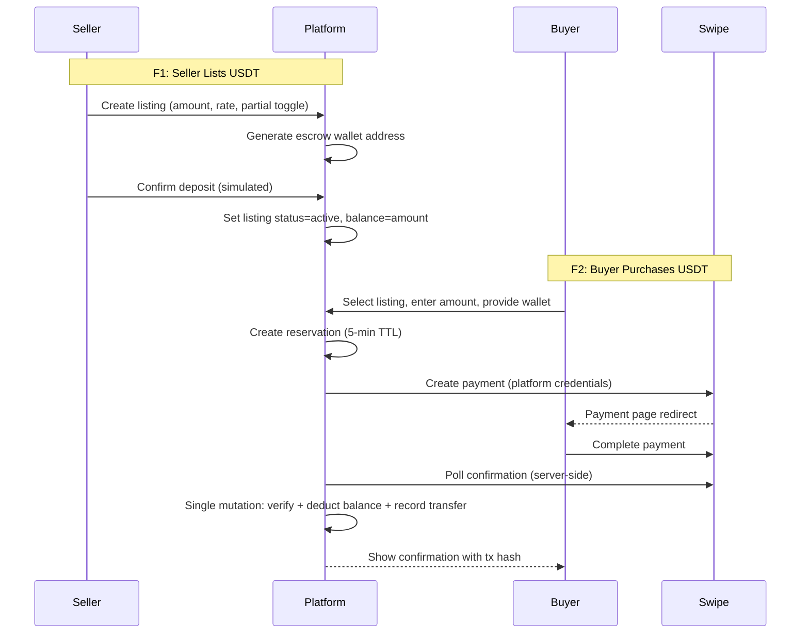

# feat: P2P Crypto Exchange + Unified Marketplace

## Summary

Implement the P2P USDT crypto exchange (simulated escrow, Swipe payment rail, reservation-based concurrency) alongside a unified marketplace with search/filter, updated seller onboarding with path selection, a buyer-facing shell for public routes, and a redesigned landing page. Phased by priority: crypto exchange first (P0), marketplace aggregation (P1), landing page (P2).

---

## Problem Frame

Maldivian crypto traders rely on informal channels with no escrow or instant settlement. Social sellers lack a unified discovery surface. Swipe's instant payment confirmation solves both — this plan implements the technical architecture for a hackathon demo that proves the concept.

(see origin: `docs/brainstorms/2026-05-21-swipe-crypto-exchange-marketplace-requirements.md`)

---

## Requirements

- R1. Onboarding path selection (Marketplace / Crypto Exchange / Both)
- R2. Marketplace onboarding (existing flow)
- R3. Crypto onboarding (TRC20 wallet address, validated)
- R4. "Both" path completes both flows
- R5. Seller creates listing (amount, rate, partial-buy toggle)
- R6. Platform generates unique escrow wallet per listing
- R7. Simulated deposit with instant confirmation
- R8. Public escrow balance display
- R9. Buyer browses active listings
- R10. Buyer enters desired amount (constrained by unreserved balance)
- R11. Buyer provides TRC20 wallet address (validated)
- R12. Platform generates Swipe payment link (platform credentials)
- R13. Server-side verified payment triggers single-mutation escrow release
- R14. Authenticated seller withdrawal (blocked during active purchases)
- R15. Unified marketplace route aggregating all stores
- R16. Text search across products
- R17. Category filtering
- R18. Seller filtering
- R20. Landing page communicates both pillars
- R21. Four entry paths (Sell Products, Sell Crypto, Shop, Buy Crypto)
- R22. "Now possible with Swipe" theme
- R23-R25. Consistent mobile/desktop layouts with buyer shell

**Origin actors:** A1 (Marketplace Seller), A2 (Crypto Seller), A3 (Buyer), A4 (Platform)
**Origin flows:** F1 (Seller Lists USDT), F2 (Buyer Purchases USDT), F3 (Seller Withdraws), F4 (Buyer Browses Marketplace)
**Origin acceptance examples:** AE1 (covers R5, R7), AE2 (covers R10, R12, R13), AE3 (covers R5, R10), AE4 (covers R14), AE5 (covers R1, R4), AE6 (covers R15, R16, R18)

---

## Scope Boundaries

### Deferred for later

- Real blockchain integration
- KYC/AML verification
- Dispute resolution
- Buyer accounts
- Real-time market rates
- Multi-currency
- Seller reputation
- Admin panel

### Outside this product's identity

- Centralized exchange (order book)
- Custodial wallet service
- DeFi features
- Fiat-to-fiat remittance

### Deferred to Follow-Up Work

- Rate limiting on payment link generation
- Accessibility audit (WCAG AA)
- Test infrastructure setup

---

## Context & Research

### Relevant Code and Patterns

- `convex/schema.ts` — existing schema to extend with exchange tables
- `convex/orders.ts` — atomic stock deduction pattern (reusable for escrow)
- `app/api/swipe/payments/create/route.ts` — payment creation with env-level credential fallback
- `app/api/checkout/create/route.ts` — order + payment creation flow
- `lib/swipe-client.ts` — Swipe API client with token caching
- `lib/swipe-demo.ts` — demo mode payment simulation
- `components/shells/layout-router.tsx` — device detection and shell routing
- `components/mobile/bottom-tab-bar.tsx` — 5-tab seller nav
- `app/seller/onboarding/page.tsx` — 3-step linear wizard

### Institutional Learnings

- Multi-tenant session auth: every mutation validates session token, derives storeId server-side
- Payment creation uses per-store credentials or falls back to env-level credentials
- Layout router checks pathname for `/seller` prefix to determine shell type

---

## Key Technical Decisions

- **Platform-level Swipe credentials for exchange**: Crypto payments use env-level credentials since MVR goes to the platform, not individual sellers. Simplifies onboarding (no Swipe creds for crypto-only sellers).
- **Soft reservation model (5-min TTL)**: When buyer initiates purchase, amount is reserved in a separate `reservations` field. Convex scheduled function expires stale reservations. Prevents overselling on concurrent partial purchases.
- **Buyer shell as new component**: Public routes (`/marketplace`, `/exchange`) use a distinct buyer shell with its own navigation, separate from the seller shell. Layout router extended to detect buyer routes.
- **TRC20-only for hackathon**: All wallet addresses (generated and user-supplied) use TRC20 format (starts with T, 34 chars). Simplifies validation to a single regex.
- **Client-side search for hackathon scale**: Marketplace search uses client-side filtering on a full product fetch rather than Convex searchIndex. Adequate for demo product count (~50 items), avoids schema migration complexity.
- **Seller type stored on stores table**: New `sellerType` field (marketplace/crypto/both) on the existing stores table. Drives conditional dashboard rendering and onboarding flow branching.

---

## Open Questions

### Resolved During Planning

- **Whose Swipe credentials for crypto payments?** Platform-level (env fallback). Crypto sellers don't provide Swipe creds.
- **Navigation model for buyer routes?** Separate buyer shell. Seller shell gets "Exchange" sidebar/tab entry for crypto management.
- **Search implementation?** Client-side filter for hackathon. SearchIndex deferred.
- **Wallet format?** TRC20 only (T + 33 alphanumeric chars).

### Deferred to Implementation

- Exact polling interval for payment confirmation (start with 2s, adjust if needed)
- Whether to show reservation countdown to buyer during purchase flow
- Exact animation/transition for listing state changes (sold out, withdrawn)

---

## High-Level Technical Design

> *This illustrates the intended approach and is directional guidance for review, not implementation specification.*

---

## Implementation Units

### U1. Convex Schema Extension

**Goal:** Add exchange tables to Convex schema — listings, wallets, transactions, and extend stores with sellerType.

**Requirements:** R1, R3, R5, R6, R8

**Dependencies:** None

**Files:**
- Modify: `convex/schema.ts`

**Approach:**
- Add `sellerType` field to stores table (optional string: "marketplace" | "crypto" | "both")
- Add `cryptoWalletAddress` field to stores table (optional string)
- New `exchangeListings` table: storeId, amount, rate, availableBalance, reservedBalance, partialAllowed, walletAddress, status, createdAt
- New `exchangeTransactions` table: listingId, buyerWallet, usdtAmount, mvrAmount, txHash (simulated), status, swipePaymentId, createdAt
- New `exchangeReservations` table: listingId, amount, expiresAt, status
- Index exchangeListings by status for active listing queries
- Index exchangeTransactions by listingId

**Patterns to follow:**
- Existing `orders` table pattern for indexing and status fields
- `productVariants` stockAvailable/stockSold pattern for balance tracking

**Test scenarios:**
- Happy path: Schema deploys successfully with new tables and indexes
- Happy path: Existing stores table continues to work with new optional fields

**Verification:**
- `npx convex dev` starts without schema errors
- Existing marketplace functionality unaffected

---

### U2. Exchange Backend Mutations

**Goal:** Implement Convex mutations for listing CRUD, deposit simulation, purchase with reservation, and withdrawal.

**Requirements:** R5, R6, R7, R10, R13, R14

**Dependencies:** U1

**Files:**
- Create: `convex/exchange.ts`

**Approach:**
- `createListing` mutation: validates session, generates TRC20-format wallet address (random T + 33 chars), creates listing with status "pending_deposit"
- `confirmDeposit` mutation: sets status to "active", sets availableBalance = amount
- `createReservation` mutation: checks availableBalance >= requested amount, decrements availableBalance, increments reservedBalance, creates reservation with 5-min expiry. Returns reservation ID
- `confirmPurchase` mutation: validates reservation exists and is not expired, creates transaction record with simulated tx hash, decrements reservedBalance, deletes reservation. Atomic single mutation
- `expireReservation` internal mutation: called by scheduler, restores availableBalance from expired reservation
- `withdrawListing` mutation: validates session + ownership, checks reservedBalance == 0, sets status to "withdrawn", returns funds to seller wallet (simulated record)
- `getActiveListings` query: returns all listings with status "active" and availableBalance > 0
- `getSellerListings` query: returns listings for authenticated seller

**Patterns to follow:**
- `convex/orders.ts` confirmPayment pattern for atomic state transitions
- `convex/stores.ts` session authentication pattern
- `convex/products.ts` for query patterns with ownership checks

**Test scenarios:**
- Happy path: Create listing → confirm deposit → listing appears in active listings
- Happy path: Reserve 50 from 100 USDT listing → available shows 50, reserved shows 50
- Happy path: Confirm purchase → reservation cleared, transaction created with tx hash
- Edge case: Reserve more than available → mutation throws error
- Edge case: Two concurrent reservations totaling > available → second reservation fails
- Edge case: Reservation expires → availableBalance restored automatically
- Error path: Withdraw with active reservations → mutation throws "has pending purchases"
- Error path: Confirm purchase with expired reservation → mutation throws "reservation expired"
- Integration: Covers AE2 — 50 USDT purchase from 100 USDT listing reduces balance to 50

**Verification:**
- All mutation functions callable from API routes
- Atomic guarantee: no partial state (balance reduced without transaction record)

---

### U3. Exchange Payment API Routes

**Goal:** API routes for creating crypto exchange payments via Swipe and confirming them.

**Requirements:** R12, R13

**Dependencies:** U2

**Files:**
- Create: `app/api/exchange/purchase/route.ts`
- Create: `app/api/exchange/purchase/[purchaseId]/status/route.ts`

**Approach:**
- POST `/api/exchange/purchase`: accepts listingId, usdtAmount, buyerWallet. Validates wallet format (TRC20 regex). Calls `createReservation` mutation. Creates Swipe payment using platform-level credentials (env vars). Returns paymentId, paymentUrl, reservationId
- GET `/api/exchange/purchase/[purchaseId]/status`: polls Swipe payment status. On confirmed: calls `confirmPurchase` mutation. Returns purchase status + transaction details
- Reuse existing `lib/swipe-client.ts` for payment creation (uses env-level credentials when no store creds passed)
- Reuse existing `lib/swipe-demo.ts` for demo mode simulation

**Patterns to follow:**
- `app/api/checkout/create/route.ts` for payment creation flow
- `app/api/swipe/payments/[paymentId]/status/route.ts` for status polling

**Test scenarios:**
- Happy path: POST with valid data → returns Swipe payment URL and reservation ID
- Happy path: Status poll after simulated payment → returns "completed" with tx details
- Error path: Invalid TRC20 wallet address → returns 400 with validation error
- Error path: Listing not found or inactive → returns 404
- Error path: Requested amount exceeds available balance → returns 400
- Integration: Covers AE2 — full purchase flow from API call through to balance reduction

**Verification:**
- Payment links generated successfully in demo mode
- Status endpoint triggers atomic escrow release on confirmation

---

### U4. Onboarding Path Selection

**Goal:** Add path selection step before existing onboarding wizard, branching into marketplace, crypto, or both flows.

**Requirements:** R1, R2, R3, R4

**Dependencies:** U1

**Files:**
- Modify: `app/seller/onboarding/page.tsx`
- Modify: `convex/stores.ts` (add setSellerType and setCryptoWallet mutations)

**Approach:**
- Insert "Step 0" before existing 3-step wizard: full-screen card selection (Marketplace / Crypto Exchange / Both)
- Marketplace path: existing steps 1-3 unchanged (phone → Swipe creds → test products)
- Crypto path: step 1 = phone, step 2 = wallet address entry with TRC20 validation, step 3 = skip (no test products for crypto)
- Both path: marketplace steps then crypto wallet step appended
- Store selection in `sellerType` field on stores table
- New `setCryptoWallet` mutation: validates TRC20 format server-side, stores on stores record
- Path selection persisted immediately so refresh doesn't lose choice

**Patterns to follow:**
- Existing step state management pattern with useState
- Existing `setSwipeCredentials` mutation for credential storage

**Test scenarios:**
- Covers AE5: Select "Both" → complete marketplace onboarding → complete crypto wallet → see both sections
- Happy path: Select "Marketplace" → existing 3-step flow works unchanged
- Happy path: Select "Crypto Exchange" → phone + wallet address steps only
- Error path: Invalid wallet address format → inline error, cannot proceed
- Edge case: Refresh mid-onboarding → returns to correct step based on stored sellerType

**Verification:**
- All three paths reach "onboarding complete" state
- `sellerType` persisted correctly for each choice
- Crypto sellers have `cryptoWalletAddress` stored

---

### U5. Buyer Shell & Navigation

**Goal:** Create a buyer-facing shell with its own navigation for /marketplace and /exchange routes.

**Requirements:** R23, R24, R25

**Dependencies:** None

**Files:**
- Create: `components/shells/buyer-shell.tsx`
- Create: `components/mobile/buyer-bottom-bar.tsx`
- Create: `components/desktop/buyer-top-nav.tsx` (modify existing)
- Modify: `components/shells/layout-router.tsx`

**Approach:**
- Buyer shell: wraps public buyer-facing routes with appropriate nav
- Mobile buyer bottom bar: 3 tabs — Home (landing), Marketplace, Exchange
- Desktop buyer nav: horizontal top nav bar with same links + "Become a Seller" CTA
- Layout router: detect buyer routes (paths starting with `/marketplace` or `/exchange`) and route to buyer shell instead of seller shell
- Existing `/shop/[slug]` routes continue using existing buyer top nav

**Patterns to follow:**
- `components/shells/mobile-shell.tsx` for shell structure
- `components/mobile/bottom-tab-bar.tsx` for tab bar pattern
- `components/desktop/buyer-top-nav.tsx` for desktop nav

**Test scenarios:**
- Test expectation: none — pure UI scaffolding, verified visually

**Verification:**
- `/marketplace` renders in buyer shell with correct navigation
- `/exchange` renders in buyer shell with correct navigation
- `/seller/*` routes still render in seller shell (no regression)
- Mobile and desktop shells render correctly per device

---

### U6. Crypto Exchange Buyer UI

**Goal:** Build the exchange listing browse page and purchase flow for buyers.

**Requirements:** R9, R10, R11, R12, R13

**Dependencies:** U2, U3, U5

**Files:**
- Create: `app/exchange/page.tsx`
- Create: `app/exchange/buy/[listingId]/page.tsx`
- Create: `components/buyer/exchange-listing-card.tsx`
- Create: `components/buyer/purchase-flow.tsx`

**Approach:**
- `/exchange` page: fetches active listings via Convex query, displays as cards sorted by lowest rate first. Each card shows: seller name, USDT available, rate (MVR/USDT), total MVR cost. Empty state when no listings
- `/exchange/buy/[listingId]` page: purchase flow with steps:
  1. Amount input (constrained by available balance, or fixed if partial disabled)
  2. Wallet address input with TRC20 validation + paste button
  3. Review (shows amount, rate, total MVR)
  4. Payment redirect (calls purchase API, redirects to Swipe)
  5. Confirmation polling (shows spinner + "Waiting for payment...")
  6. Success screen (simulated tx hash, "USDT transferred" message)
- Payment return: 5-second countdown page with auto-redirect back. Manual "Return to app" button
- Mobile: full-screen pages with back navigation. Desktop: centered content with sidebar context

**Patterns to follow:**
- `app/checkout/[orderId]/page.tsx` for payment polling pattern
- `app/shop/[storeSlug]/product/[productId]/page.tsx` for product detail layout
- `lib/use-payment-status.ts` for polling hook adaptation

**Test scenarios:**
- Covers AE2: Buy 50 USDT from 100 USDT listing at 25.50 → payment for 1275 MVR → confirmation
- Covers AE3: Listing with partial disabled → no amount input shown, full amount only
- Happy path: Browse listings → select → enter amount → enter wallet → pay → success
- Edge case: Listing sells out while buyer is on page → shows "no longer available"
- Error path: Invalid wallet format → inline error prevents proceeding
- Error path: Payment timeout (>5 min) → shows "payment not detected, check your Swipe app"

**Verification:**
- Full purchase flow works end-to-end in demo mode
- Under 60 seconds from listing selection to confirmation (success criterion)

---

### U7. Crypto Exchange Seller UI

**Goal:** Build the seller's crypto dashboard for creating listings, viewing escrow, and withdrawing.

**Requirements:** R5, R7, R8, R14

**Dependencies:** U2, U4

**Files:**
- Create: `app/seller/exchange/page.tsx`
- Create: `app/seller/exchange/new/page.tsx`
- Create: `components/seller/exchange-listing-card.tsx`
- Create: `components/seller/deposit-confirmation.tsx`
- Modify: `components/mobile/bottom-tab-bar.tsx` (add Exchange tab for crypto sellers)
- Modify: `components/desktop/seller-sidebar.tsx` (add Exchange nav item)

**Approach:**
- `/seller/exchange` dashboard: shows seller's listings with status, available balance, reserved balance, and actions (withdraw)
- `/seller/exchange/new` create listing flow:
  1. Enter USDT amount and rate (MVR per USDT)
  2. Toggle partial-buy allowed (default: on)
  3. Platform shows generated escrow address + "Confirm Deposit" button
  4. On confirm: simulated instant deposit, listing goes active
- Withdrawal: confirmation modal showing amount + destination wallet. Blocked if reservedBalance > 0 (shows message explaining pending purchases)
- Seller nav: conditionally show "Exchange" tab/sidebar item when sellerType is "crypto" or "both"
- Escrow display: each listing card shows wallet address (truncated) + full balance info

**Patterns to follow:**
- `app/seller/products/new/page.tsx` for create form pattern
- `app/seller/payments/page.tsx` for listing/card layout
- `components/seller/swipe-wallet-card.tsx` for balance display

**Test scenarios:**
- Covers AE1: Create 100 USDT listing at 25.50, confirm deposit → listing appears active with wallet visible
- Covers AE4: Listing with 50 USDT remaining → withdraw → listing disappears
- Happy path: Create listing → see it in dashboard → escrow address and balance displayed
- Error path: Withdraw with pending reservations → blocked with explanation
- Edge case: Seller with sellerType="marketplace" → Exchange tab hidden

**Verification:**
- Full seller flow: create listing → confirm deposit → see active → withdraw
- Navigation items appear/hide correctly based on sellerType

---

### U8. Unified Marketplace

**Goal:** Build the aggregated marketplace with search, category filtering, and seller filtering.

**Requirements:** R15, R16, R17, R18

**Dependencies:** U5

**Files:**
- Create: `app/marketplace/page.tsx`
- Create: `components/buyer/marketplace-search.tsx`
- Create: `components/buyer/marketplace-filters.tsx`
- Create: `components/buyer/marketplace-product-card.tsx`
- Create: `convex/marketplace.ts` (query to fetch all active products across stores)

**Approach:**
- New Convex query: `getAllActiveProducts` — fetches all products with status "active" from all stores that have sellerType "marketplace" or "both". Includes store name/slug for each product
- `/marketplace` page: product grid with search bar + filter sidebar/drawer
- Search: client-side filter on product name and description (case-insensitive includes)
- Category filter: extract unique categories from fetched products, render as filter chips/tabs
- Seller filter: extract unique stores, render as selectable list
- Product cards: image, name, price, seller name, category badge. Click → existing `/shop/[storeSlug]/product/[productId]` page
- Empty state: "No products found" with clear filters affordance
- Mobile: search bar at top, horizontal filter chips, vertical product grid
- Desktop: search bar + sidebar filters, 3-4 column product grid

**Patterns to follow:**
- `app/shop/[storeSlug]/page.tsx` for product grid rendering
- `components/buyer/product-card.tsx` for card component
- `components/buyer/product-grid.tsx` for grid layout

**Test scenarios:**
- Covers AE6: Search "abaya" → results show matching products from multiple stores with seller name
- Happy path: Page loads → shows all products from all stores
- Happy path: Filter by category "Clothing" → only clothing products shown
- Happy path: Filter by seller "Island Finds MV" → only that store's products
- Edge case: No products match search → "No products found" with clear button
- Edge case: Combine search + category filter → intersection results

**Verification:**
- Products from multiple stores appear on one page
- Search, category, and seller filters work independently and combined
- Clicking a product navigates to existing product detail page

---

### U9. Landing Page Redesign

**Goal:** Redesign landing page to communicate both marketplace and crypto exchange value props with equal weight.

**Requirements:** R20, R21, R22

**Dependencies:** U5 (for nav links to /marketplace and /exchange)

**Files:**
- Modify: `app/page.tsx`

**Approach:**
- Hero: unified headline about Swipe enabling what wasn't possible before. Two-column CTA: "Shop / Buy Crypto" for buyers, "Sell Products / Sell Crypto" for sellers
- Section 1: "How it works" — two parallel tracks showing marketplace flow and crypto exchange flow side by side
- Section 2: "Why Swipe?" — trust, speed, transparency. Applied to both pillars
- Section 3: Before/After — adapted from existing but covering both use cases (marketplace: no fake slips; crypto: no scams)
- Final CTA: four buttons (Shop Marketplace, Buy Crypto, Sell Products, Sell Crypto)
- Mobile: stacked sections, single column. Desktop: side-by-side where appropriate
- Color: maintain existing amethyst/ruby system. Add subtle differentiation for crypto sections (slightly cooler tones)

**Patterns to follow:**
- Existing `app/page.tsx` structure (hero → features → CTA)
- Existing TailwindCSS color utilities and spacing

**Test scenarios:**
- Test expectation: none — visual design verified via browser inspection

**Verification:**
- Landing page clearly communicates both pillars
- All four entry CTAs link to correct routes
- Mobile and desktop layouts are distinct and polished
- "Now possible with Swipe" narrative is coherent

---

### U10. Seller Dashboard Conditional Sections

**Goal:** Update seller dashboard to show marketplace and/or crypto sections based on sellerType.

**Requirements:** R4

**Dependencies:** U4, U7

**Files:**
- Modify: `app/seller/page.tsx`

**Approach:**
- Read sellerType from store record
- Marketplace section: existing stats cards (revenue, orders, products) — shown for "marketplace" and "both"
- Crypto section: summary cards (active listings count, total USDT escrowed, completed trades) — shown for "crypto" and "both"
- "Both" sellers see both sections with a section divider
- Quick-action cards: "Create Listing" for crypto sellers, "Add Product" for marketplace sellers

**Patterns to follow:**
- Existing dashboard card pattern in `app/seller/page.tsx`
- `components/seller/dashboard-card.tsx` for card component

**Test scenarios:**
- Happy path: sellerType="marketplace" → only marketplace stats shown
- Happy path: sellerType="crypto" → only crypto stats shown
- Happy path: sellerType="both" → both sections visible with divider
- Edge case: New seller with no sellerType yet → redirect to onboarding

**Verification:**
- Dashboard renders correctly for all three seller types
- No broken state for sellers who haven't completed onboarding

---

## Phased Delivery

### Phase 1 — Foundation (U1, U2, U3, U4, U5)
Schema, backend mutations, payment routes, onboarding, and buyer shell. After this phase, the backend is functional and both seller paths work.

### Phase 2 — Crypto Exchange UI (U6, U7, U10)
Buyer purchase flow, seller dashboard, and conditional sections. After this phase, the P0 success criterion is achievable (end-to-end crypto demo).

### Phase 3 — Marketplace + Landing (U8, U9)
Unified marketplace and landing page redesign. Completes P1 and P2 success criteria.

---

## System-Wide Impact

- **Interaction graph:** New Convex scheduled functions for reservation expiry. New API routes under `/api/exchange/`. Layout router gains buyer-route detection. Bottom tab bar and sidebar gain conditional entries.
- **Error propagation:** Exchange payment failures surface to buyer UI via status polling (same pattern as marketplace checkout). Reservation expiry is silent (background scheduled function).
- **State lifecycle risks:** Reservation expiry must fire reliably — if Convex scheduler hiccups, stale reservations lock up balance. Mitigation: also check expiry at query time in `getActiveListings`.
- **API surface parity:** Existing `/shop/[slug]` and `/checkout/[orderId]` routes unchanged. New `/marketplace` and `/exchange` routes are additive.
- **Unchanged invariants:** Existing seller authentication, marketplace checkout flow, per-store shop pages, Meta OAuth — all unchanged.

---

## Risks & Dependencies

| Risk | Mitigation |
|------|------------|
| Convex scheduled functions unreliable for reservation expiry | Also validate expiry at query time; treat scheduler as best-effort cleanup |
| 60-second demo target aggressive on mobile | Pre-fill demo wallet address during presentations; measure from "Buy" click not page load |
| Two-pillar landing page feels unfocused | Lead with unified "trust" narrative, split into pillars only in detail sections |
| Onboarding branching adds complexity to existing wizard | Keep path selection as a single card-choice screen before entering existing linear flow |

---

## Sources & References

- **Origin document:** [docs/brainstorms/2026-05-21-swipe-crypto-exchange-marketplace-requirements.md](docs/brainstorms/2026-05-21-swipe-crypto-exchange-marketplace-requirements.md)
- Related pattern: `convex/orders.ts` — atomic payment confirmation
- Related pattern: `docs/solutions/architecture-patterns/multi-tenant-session-auth-2026-05-20.md`
- Related pattern: `lib/swipe-client.ts` — credential fallback to env vars
